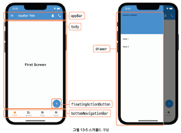
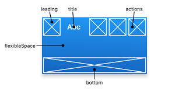

# 머티리얼과 쿠퍼티노 디자인
### Material 디자인
* MaterialApp: Material 디자인을 적용하는 위젯으로, Material은 Flat Design의 장정을 살리면서 그림자의 효과를 이용하여 입체감을 살리는 디자인 방식이다.
    * Flat Design: 복잡한 그래픽이 아닌 단순한 색상과 구성을 통해 직관적인 인식이 가능하도록 구성하는 2차원 디자인 방식
* 대부분 플러터 앱은 위젯 트리의 root를 MaterialApp으로 구성한다.

1. debugShowCheckedModeBanner - 디버그 배너 보이기
    * MaterialApp 위젯을 사용하면 우측 상단에 DBUG라는 배너가 출력된다.
    * MaterialApp의 **debugShowCheckedModeBanner** 속성이 true일 때 나온다.
```
MaterialApp(
    debugShowCheckedModeBanner: false,
)
```

2. Theme - 테마 설정하기
    * MaterialApp 위젯은 기본으로 파란색 AppBar와 checkbox이다. ThemeData 객체를 MaterialApp의 theme 속성에 지정하면 바꿀 수 있다.
```
# pink 색상으로 변경
MaterialApp(
    debugShowCheckedModeBanner: false,
    theme: ThemeData(
        primarySwatch: Colors.pink,
    )
)

# 나머지는 핑크, AppBar 색상 주황으로 변경
MaterialApp(
    debugShowCheckedModeBanner: false,
    theme: ThemeData(
        primarySwatch: Colors.pink,
        appBarTheme: AppBarTheme(
            backgroundColor: Colors.orange,
            foregroundColor: Colors.black
        )
    )
)
```


### Cupertino 디자인
* CuptertinoApp: 플러태 앱을 iOS 스타일로 만들고 싶으면 CupterrinoApp 위젯을 사용한다.
* package:flutter/cupertino.dart 패키지에서 제공하는 위젯으로 iOS 앱 스타일로 만들 수 있다.
```
CupertinoApp(
    debugShowCheckedModeBanner: false,
    theme: CupertinoThemeData(bright: Brightness.light),
    home: CupertinoPageScaffold(
        navigatorBar: CupertinoNavigationBar(
            middle: Text('Cupertino Title'),
        ),
        child: ListView(
            children: <widget>[
                CupertinoButton(
                    onPressed: () {},
                    child: Text('click'),
                ),
                Center(
                    child: Text('HelloWorld'),
                )
            ]
        )
    )
)
```

1. Platform API 활용하기
* MaterialApp 또는 CupertinoApp 위젯을 이용하면 안드로이드와 iOS에서 똑같은 스타일이 적용된다. 그런데 플러터 앱이 안드로이드에서는 Material 스타일로 나오고, iOS에서는 Cupertino 디자인이 나올 수 있게 할 수 있다.
* 앱이 실행되는 플랫폼을 식별해야 하는데, 이때 dart:io에서 제공하는 **Platform**을 이용한다. Platform은 화면 스타일을 플랫폼별로 다르게 제공하는 것 외에 플랫폼별로 다르게 차리해야 할 때 활용할 수 있다.
* 플랫폼을 식별하기 위한 Platform의 정적 속성(static property)
    * isAndriod: 안드로이드 식별
    * isFuchsia: 푸크시아 식별
    * IsIOS: iOS 식별
    * isLinux: 리눅스 식별
    * isMacOS: macOS 식별
    * isWindows: 윈도우 식별
```
# 앱이 동작하는 플랫폼을 Platform API로 식별하는 코드
Widget platformUI() {
    if(Platform.IOS) {
        return Text('I am iOS Phone,
                    style: TextStyle(fontWeight: FontWeight.bold, fontSize: 25),);
    } else if(Platform.isAndroid) {
        return Text('I am Android Phone',
                    style: TextStyle(fontWeight: FontWeight.bold, fontSize: 25));
    } else {
        return Text('unKnown Device',
                    style" TextStyle(fontWeight: FontWeight.bold, fontSize: 25));
    }
}
```


### 기기 모양에 대처하기
* SafeArea 위젯: 기기마다 화면의 생김새가 다르다. 따라서 우리가 만든 화면이 어떤 기기에서 출력이 되든 정상적으로 출력할 수 있게 알아서 조정해 준다.
```
Scaffold(
    body: SafeArea(
        child: SingleChildScrollView(
            child: Column(
                children: getWidgets(),
            )
        )
    )
)
```


### Scaffold 위젯
* Scaffold 위젯은 앱 화면의 골격을 제공하는 위젯이다.
* Scaffold 위젯이 제공하는 속성들
    * appBar: 앱 상단 구성
    * body: 앱 본문 구성
    * floatingActionButton: 화면에서 떠 있는 듯한 둥근 버튼 구성(우측 하단)
    * drawer: 가로로 열리는 콘텐츠 구성
    * bottomNavigationBar: 화면 하단의 버튼 구성

    <p align="center"> 
        
    </p>

1. appBar - 앱바
    * **AppBar 위젯**을 적용하며 AppBar 위젯에는 다양한 구성 요소를 설정할 수 있다.
        * leading: 왼쪽에 출력할 위젯
        * title: 타이틀 위젯
        * actions: 오른쪽에 사용자 이벤트를 위한 위젯들
        * bottom: 앱바 하단을 구성하기 위한 위젯
        * flexibleSpace: 앱바 상단과 하단 사이의 여백을 구성하기 위한 위젯

        <p align="center"> 
            
        </p>

    * context는 BuildContext 타입의 객체로 위젯 트리 내에서 위젯의 위치를 나타낸다. 따라서 context를 통해 부모나 자식 위젯에 접근할 수 있으며, 'Theme.of(context)' 또는 'Navigator.of(context)'와 같은 메서드를 사용해 테마나 내비게이터 등의 정보를 가져올 수 있다.

    * Theme.of(context)는 현재 위젯 트리(현재 context)에서 가장 가까운 'Theme' 위젯을 찾아 그 객체를 반환한다. 근처에 Theme이 정의되어 있지 않으면 Flutter의 기본 테마가 적용된다.

    * Flutter의 기본 테마는 기본(primary) 색상: 파란색, 강조(accent) 색상: 청록색이다.
    ```
    Scaffold(
        appBar: AppBar(
            bottom: PreferredSize(
                preferredSize: const Size.fromHeight(48.0),

                # Theme.of(context).colorScheme을 통해 colorScheme 객체를 가져와 복사하여 색깔을 변경
                # 변경된 것을 기존 Theme 객체를 copyWith하여 복사한 Theme 객체에 적용
                child: Theme(
                    data: Theme.of(context).copyWith(
                        colorScheme: Theme.of(context).colorScheme.copyWith(
                            secondary: Colors.white,
                            ),
                    ),
                    child: Container(
                        hegiht: 48.0,
                        aligment: Alignment.center,
                        child: Text('AppBar Bottom Text')
                    ),
                ),
            ),
            flexibleSpace: Container(
                decoration: BoxDecoration(
                    image: DecorationImage(
                        image: AssetImage('images/big.jpeg'),
                        fit: BoxFit.fill
                    )
                )
            ),
            title: Text('AppBar Title'),
            actions: <Widget>[
                IconButton(
                    icon: const Icon(Icons.add_alert),
                    onPressed: () {}
                ),
                IconButton(
                    icon: const Icon(Icons.phone),
                    onPressed: () {}
                )
            ]
        )
    )
    ```

2. bottomNavigationBar - 하단 내비게이션 바
    * 보통 **BottomNavigationBar 위젯**으로 구성한다. 각 버튼은 **BottomNavigationBarItem 위젯**으로 구성하는데, icon, label 속성으로 아이콘 이미지와 문자열을 지정한다. 
    
    * BottomNavigationBarType 속성값을 shifting으로 지정하면 하단 버튼을 선택할 때 하단 내비게이션 바의 배경색이 바뀐다. 속성값을 fixed할 경우 애니메이션 및 색 변화는 일어나지 않는다.

    * 하단 내비게이션 바의 버튼을 선택했을 때 **onTap**에 지정한 함수에서 조정된다.
    
    * 선택한 버튼의 색상은 **selectedItemColor** 속성으로 지정한다.
    ```
    Scaffold(
        bottomNavigationBar: BottomNavigationBar(
            type: BottomNavigationBarType.shifting,
            items: <BottomNavigationBarItem>[
                BottomNavigationBarItem(
                    icon: Icon(Icons.home),
                    lable: 'First',
                    backgroundColor: Colors.green
                ),
                BottomNavigationBarItem(
                    icon: Icon(Icons.business),
                    lable: 'Second',
                    backgroundColor: Colors.red
                ),
                BottomNavigationBarItem(
                    icon: Icon(Icons.school),
                    lable: 'Third',
                    backgroundColor: Colors.purple
                ),
                BottomNavigationBarItem(
                    icon: Icon(Icons.school),
                    lable: 'Fourth',
                    backgroundColor: Colors.pink
                ),
            ],
            currentIndex: _selectedIndex,
            selectedItemColor: Colors.amber[800],
            onTap: _onItemTapped,
        )
    )
    ```

3. drawer - 드로어
    * 화면에 보이지 않다고 왼쪽 혹은 오른쪽으로 슬라이드를 하면 나타나는 화면으로 보통 **Drawer** 위젯으로 구성한다.
    * DrawerHeader 위젯으로 ListView의 항목 윗 부분을 다양하게 꾸밀 수 있다.
    * drawer를 추가하면 AppBar 왼족에 자동으로 토글 버튼이 나온다.
    * Drawer가 아닌 endDrawer 속성을 사용하면 드로어가 오른쪽에서 열린다.
    ```
    scaffold(
        drawer: Drawer(
            child: ListView(
                padding: EdgeInsets.zero,
                children: <Widget>[
                    DrawerHeader(
                        child: Text('Drawer Header),
                        decoration: BoxDecoration(
                            color: Colors.blue
                        )
                    ),
                    ListTile(
                        title: Text('Item 1'),
                        onTap: () {},
                    ),
                    ListTile(
                        title: Text('Item 2'),
                        onTap: () {},
                    )
                ]
            )
        )
    )
    ```


### 커스텀 스크롤 뷰와 슬리버 앱바
* Scaffold 위젯의 appBar 세로 크기가 커지면 본문 크기가 줄어든다. 따라서 본문이 스크롤될 때 appBar가 함께 스크롤되어 접혔다가 다시 나오게 해야 한다. 이처럼 화면의 한 영역에서 스크롤이 발생할 때 다른 영역도 함께 스크롤되게 하려면 **CustomScrollView**를 이용하면 된다.

* 스크롤이 발생할 모든 위젯을 CustomScrollView 하위에 추가해야 한다. 단, CustomScrollView 하위에서 스크롤 정보를 공유할 수 있는 위젯이어야 함께 스크롤이 된다. 이를 위해 SliverList, SliverFixedExtentList, SliverGrid, SliverAppBar 등을 제공한다.

* 즉, CustomScrollView 하위에 SliverList나 SliverGrid로 화면을 구성하고, 이 위젯이 스크롤될 때 함께 스크롤할 화면 상단을 SliverAppBar로 구현한다.

*  delegate 속성은 리스트 아이템을 생성하는 방법을 정의한다. 여기서 SliverChildBuilderDelegate를 사용해 아이템을 동적으로 생성한다.
* 따라서 스크롤을 내릴 때마다 ListTile이 동적으로 계속 만들어 진다.
```
CustomScrollView(
    slivers: [
        SliverAppBar(
            ...생략...
        ),
        SliverFixedExtentList(
            itemExtent: 50.0,
            delegate: SliverChildBuilderDelegate(
                (BuildContext context, int index) {
                    return ListTile(title: Text('Hello World Item $index').);
                }
            )
        )
    ]
)
```

* SliverAppBar 속성
    * pinned 속성: SilverAppBar가 접힐 때 모두 사라져야 하는지(false), 한 줄 정도는 유지해야 하는지(ture)를 설정한다.
    * floating 속성: SilverAppBar가 접혔다가 다시 나올 때 가장 먼저 나와야 하는지를 설정한다. false로 지정하면 항목이 스크롤되어 모두 나온 후 마지막에 SilverAppBar가 나오고, true로 지정하면 스크롤 하자마자 SilverAppBar가 나온다.
    * snap 속성: floating 속성값이 true일 때만 설정할 수 있다. SilverAppBar가 나올 때 목록의 스크롤을 멈추면 SilverAppBar도 멈춰야 하는지(false), 아니면 끝까지 확장되어 모두 나와야 하는지(true)를 설정한다.