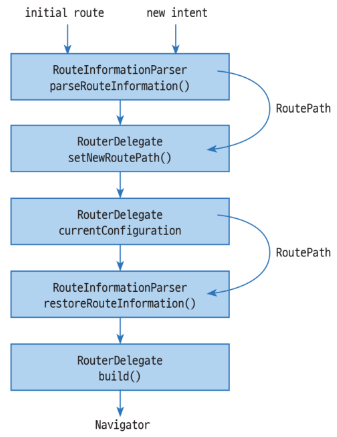
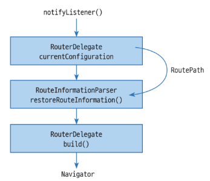

# Navigation을 이용한 화면 전환
### Navigation 사용하기
1. route 이해하기
    * 위젯은 계층 구조로 구성되어 있다. 우리가 쇼핑 앱을 만들려고 할 때 로그인, 상품 목록, 장바구니 화면을 각각의 위젯 클래스로 만들고 MyApp이라는 루트 위젯에 추가하면 계층 구조를 이룰 수 있다. 그러나 MyApp은 한 번에 한 화면씩 나오게 해야 하는데 이때, **Route** 또는 **Navigator**를 사용하면 화면 전환이 가능하다.
    
    * route는 **화면을 지칭하는 객체**이다. 화면은 위젯 클래스로 만들어야 하지만, 그 위젯 클래스를 포함해 화면을 구성하는 다양한 정보를 Route 객체에 설정하여 화면을 표현한다.

    * Navigator 위젯은 Route 객체로 화면을 전환해 준다. Navigator는 화면이 전환되면서 생성된 Route들을 **스택 구조**로 관리하는데, 화면 전환뿐만 아니라 이전 화면으로 돌아가거나 화면 전환 애니메이션 효과 등 다양한 기법을 제공한다.

    * Navigator.push() 함수의 두 번째 매개변수가 전환할 화면을 지칭하는 Route 객체이다. 라우트 객체는 추상형으로 직접 구현하거나 Material design에서 제공하는 애니메이션 기능등이 포함된 **MaterialPageRoute**를 이용한다. Route 객체의 builder 함수에서 전환할 화면의 위젯 객체를 생성해 반환하면 된다.

    * Navigator.push() 함수의 두 번째 매개변수로 지칭한 route 객체를 Navigator가 관리하는 스택에 추가한다. 화면에는 Navigator 스택에서 맨 위에 있는 route의 위젯이 출력된다.
```
# 앱 화면 구성
void main() {
    runApp(MyApp());
}

# OneScreen 위젯을 home으로 지정했기에 처음엔 OneScreen 위젯이 출력된다.
class MyApp extends StatelessWidget {
    @override
    Widget build(BuildContext context) {
        return MaterialApp(
            home: OneScreen(),
        )
    }
}

class OneScreen extends StatelessWidget {
}

class TwoScreen extends StatelessWidget {
}

# OneScreen 화면에서 버튼을 눌렀을 때 TwoScreen 화면으로 전환하고 싶을 때 Navigator.push() 함수를 호출한다
ElevatedButton(
    child: Text('Go Two Screen'),
    onPressed: () {
        Navigator.push(
            context,
            MaterialPageRoute(builder: (context) => TwoScreen()),
        );
    }
)

# TwoScreen에서 이전 화면으로 돌아가고 싶을 때 Navigator.pop() 함수를 이용한다.
ElevatedButton(
    onPressed: () {
        Navigator.pop(context);
    },
    child: Text('Go back!')
)
```

2. route 이름으로 화면 전환하기
    * 화면이 많아질 수록 화면을 이동할 때 Navigator.push를 이용하는 것은 비효율적이다. 이때 MaterialApp의 **routes 속성**을 이용하면 앱의 화면을 등록하고 이 정보를 바탕으로 화면 전환을 할 수 있다.
    
    * initialRoute 속성은 처음 출력한 Route 이름을 설정한다.

    * routes에 등록한 이름으로 화면을 전환하려면 Navigator.pushNamed() 함수를 이용한다.
```
# route 이름과 화면의 위젯을 등록하는 예
class MyApp extends StatelessWidget {
    @override
    Widget build(BuildContext context) {
        return MaterialApp(
            initialRoute: '/',
            routes: {
                '/': (context) => OneScreen(),
                '/two': (context) => TwoScreen(),
                '/three': (context) => ThreeScreen()
            },
        )
    }
}

# route 이름으로 화면 전환
ElevatedButton(
    child: Text('Go Two Screen'),
    onPressed: () {
        Navigator.pushNamed(context, '/two');
    }
)
```


### 화면 전환 시 데이터 전달하기
1. push() 함수로 화면 전환할 때 데이터 전달
    * Navigator.push() 함수로 화면을 전활할 때 두 번째 매개변수에 route를 직접 준비해야 하며 route에서 전환할 위젯 객체를 생성해야 한다. 따라서 다음 화면에 전달할 데이터는 **생성자의 매개변수**로 전달하면 된다.
    ```
    Navigator.push(
        context,
        MaterialPageRoute(builder: context => TwoScreen("hello"))
    );
    ```

2. pushNamed() 함수로 화면 전환할 때 데이터 전달
    * **arguments라는 매개변수**를 이용한다.

    * 전달된 데이터는 **ModalRoute.of()** 를 이용해 얻을 수 있다.

    * as 키워드는 **타입 캐스팅**으로 객체를 특정 타입으로 변환할 때 사용된다.
    ```
    ElevatedButton(
        onPressed: () {
            Navigator.pushNamed(
                context,
                '/three',
                arguments: 10
            );
        },
        child: Text('Go Three Screen')
    )

    int arg = ModalRoute.of(context)?.settings.arguments as int;
    ```
    * 여러 개의 데이터를 전달하려면 **JSON**으로 데이터를 구성한다.

    * JSON 형식의 데이터를 받을 때는 **Map 객체**로 얻어서 이용하면 된다.
    ```
    Navigator.pushNamed(
        context,
        '/three',
        arguments: {
            "arg1": 10,
            "arg2": "hello"
        }
    );

    Map<String, Object> args = ModalRoute.of(context)?.settings.arguments as Map<String, Object>;
    ```
    * arguments 속성으로 데이터를 전달할 때 개발자가 만든 클래스 객체도 가능하다.
    ```
    Navigator.pushNamed(
        context,
        '/three',
        arguments: {
            "arg1": 10,
            "arg2": "hello",
            "arg3": User('kkang', 'seoul')
        }
    );
    ```

3. pop() 함수로 화면 전환 시 데이터 전달
    * pop 함수의 두 번째 매개변수를 이용한다. 개발자가 만든 클래스 객체도 전달할 수 있다.
    ```
    ElevatedButton(
        onPressed: () {
            Navigator.pop(context, 'world');
        }
    )
    ```
    * pop() 함수로 전달한 데이터는 화면을 전환할 때 사용했던 push()나 pushNamed() 함수의 반환값으로 받을 수 있다.

    * async 키워드를 통해 비동기 함수로 선언한다. 비동기 함수란 함수가 실행되는 중에 다른 작업을 수행할 수 있는 것을 의미한다.

    * await 키워드는 비동기 작업이 끝날 때까지 기다리며 그 동안 다른 작업이 블로킹되지 않도록 한다. 비동기 작업의 결과물이 필요 없는 경우에는 await 키워드를 사용하지 않아도 된다.
    ```
    onPressed: () async {
        final result = await Navigator.push(
            context,
            MaterialPageRoute(builder: (context) => TwoScreen("hello"))
        );
        print('result: ${result}');
    }
    ```

### onGenerateRoute - 동적 라우트 등록
* 같은 route 이름으로 다른 화면이 나와야 하거나, 전달된 데이터를 분석해 추가하거나 제거하는 작업이 필요할 수 있다. 이때, MaterialApp의 onGenerateRoute 속성을 이용한다.

* onGenerateRoute 속성에 등록하는 함수의 매개변수는 route 정보가 담긴 **RouteSettings 객체**이다. 이 객체의 **name 속성**은 화면을 전환할 때 지정한 route 이름이며, **arguments 속성**은 전달한 데이터이다.
```
# '/two' 이름으로 화면 전환을 시도할 때 TwoScreen이 나오거나 ThreeScreen이 나온다.
# arguments 속성값이 있으면 ThreeScreen으로, 없으면 TwoScreen으로 화면 전환이 이뤄진다.
onGenerateRoute: (settings) {
    if (settings.name == '/two') {
        final arg = settings.arguments;
        if (arg != null) {
            return MaterialPageRoute(
                builder: (context) => ThreeScreen(),
                settings: settings
            );
        } else {
            return MaterialPageRoute(
                builder: (context) => TwoScreen(),
            );
        }
    } 
}
```

* MaterialApp의 routes와 onGenerateRoute 속성을 함께 등록할 수도 있다. 이때 routes 속성에 등록한 route 이름과 onGenerateRoute 속성에서 RouteSettings로 분석한 라우트 이름이 같을 수 있다.

* '/two' 이름으로 화면 전환 시 routes 속성에 등록된 정보대로 이동한다. 즉, TwoScreen이 나오며 onGenerateRoute의 함수는 호출되지 않는다. '/four' 이름으로 화면 전환 시에 onGenerateRoute의 함수가 호출된다.
```
return MaterialApp(
    initialRoute: '/',
    routes: {
        '/': (context) => OneScreen(),
        '/two': (context) => TwoScreen(),
        '/three': (context) => ThreeScreen()
    },
    onGenerateRoute: (settings) {
        if (settings.name == '/two') {
            return MaterialPageRoute(
                builder: (context) => ThreeScreen(),
                settings: settings
            );
        } else if (settings.name == '/four') {
            return MaterialPageRoute(
                builder: (context) => ThreeScreen(),
                settings: settings
            );
        }
    }
)
```


### Navigator 스택 제어하기
* Navigator는 route 객체를 스택 구조로 관리한다. 이미 화면에 출력되어서 스택에 있는 위젯을 대상으로 다시 push()나 pushNamed()를 호출하면 객체가 다시 생성되어 스택에 쌓인다. Navigator로 화면을 전환할 때 위젯은 **singleton**으로 동작하지 않는다.

1. mybePop(): 스택에 하나뿐인 위젯에서 pop() 함수를 호출하면 앱이 종료되는데 이를 방지하기 위한 함수이다.
```
Navigator.mybePop(context);
```

2. canPop(): 현재 위젯을 스택에서 제거할 수 있는지를 판단해주는 함수이다. 즉, 스택에서 맨 아래에 있는지를 확인해 준다. 스택에서 제거할 수 있으면 true를 없으면 false를 반환한다.
```
onPressed: () {
    if(Navigator.canPop(context)) {
        Navigator.pop(context);
    }
}
```

3. pushReplacementNamed(), popAndPushNamed(): 현재 위젯을 대체하거나 제거한 후 새로운 위젯을 실행하는 함수이다. 이 함수를 호출하는 위젯은 스택에 남아있지 않다.
```
Navigator.pushReplacementNamed(context, '/three');

Navigator.popAndPushNamed(context, '/three');
```

4. pushNamedAndRemoveUntil(): 특정 위젯을 화면에 출력하는 함수로 **원하는 위치까지 스택에서 제거**한 후 화면을 이동할 수 있다. 이 함수의 매개변수는 총 3개인데 2번째 매개변수는 이동할 위젯의 이름이고 3번째 매개변수에 따라 다르게 동작한다. 3번째 매개변수에 지정한 함수가 **true**를 반환하면 pushNamed() 함수와 똑같이 동작한다. 반대로 **false**인 경우 스택을 다 비우고 새로운 위젯을 추가한다. **withName()** 함수로 스택에 있는 특정 위젯을 지정하면 해당 위젯 위에 있는 위젯들만 스택에서 제거한 후 새로운 위젯을 추가한다.
```
Navigator.pushNamedAndRemoveUntil(context, '/four', (route) => true);

Navigator.pushNamedAndRemoveUntil(context, '/four', (route) => false);

Navigator.pushNamedAndRemoveUntil(context, '/four', ModalRoute.withName('/one'));
```

5. popUntil(): pop() 함수는 스택에서 맨 위에 있는 위젯을 제거하여 이전 화면으로 돌아가는 반면에 popUntil() 함수는 특정 위젯으로 한 번에 되돌아갈 수 있다. popUntil() 함수의 두 번째 매개변수에 스택에 있는 특정 위젯을 설정하면 이 위젯 위에 있는 모든 위젯을 제거한다.
```
ElevatedButton(
    onPressed: () {
        Navigator.popUntil(context, ModalRoute.withName('/two'));
    },
    child: Text('Pop Until')
)
```


## Navigation 2.0
### Navigation 2.0 기본 구조
* Page: 출력할 화면 정보로 Page의 subclass로 만들어진 **Materialpage**나 **CupertinoPage** 위젯을 이용한다.

* Router: 페이지 정보를 스택 구조로 가지는 위젯

* RouteInformationParser: 플랫폼에서 앱에 전달하는 라우팅 정보를 분석하는 역할을 한다. 분석한 라우팅 정보는 RouterDelegate에 전달된다.

* RouterDelegate: 다양한 상황에 맞는 라우팅 처리


### Navigator와 Page
* Navigation 2.0의 구성 요소로 **Page**는 위젯을 포함한 하나의 화면을 구성하는 정보이며, 이 Page를 스택 구조로 출력해 주는 위젯이 **Navigator**이다.

* MyApp의 build 함수에서 반환한 위젯이 Navigator이다.
* Navigator에 **pages**와 **onPopPage** 속성을 반드시 설정해야 한다.
    * pages: Navigator의 스택에 포함할 페이지를 여러 개 추가할 수 있다.
    * onPopPage: 이 속성에 설정한 함수는 AppBar에서 제공하는 뒤로 가기 버튼(back button)을 누를 때 호출된다.

* 아래 코드는 화면이 하나로 구성되어 있기에 뒤로 가기 버튼이 생성되지 않는다.
```
class MyApp extends StatelessWidget {
    @override
    Widget build(BuildContext context) {
        return MaterialApp(
            title: 'Navigator Test',
            home: Navigator(
                pages: [
                    MaterialPage(
                        child: OneScreen()
                    )
                ],
                onPopPage: (route, result) => route.didPop(result)
            )
        )
    }
}
```

* 딥 링크(deep link): 앱은 첫 화면부터 출력하지만 딥 링크로 실행하면 특정 화면부터 출력한다. 특정 화면이 처음에 출력되면 앱바에 뒤로 가기 버튼이 출력되지 않지만 deep link를 사용하면 특정 화면부터 출력을 했어도 뒤로 가기 버튼을 통해 전 화면으로 돌아갈 수 있다.
```
# 현재 스택에는 두 개의 화면이 저장되어 있으며, 스택의 최상위 저장된 page가 출력되기에 TwoScreen이 나온다. 
class MyApp extends StatelessWidget {
    bool _isDeepLink = true; # 딥 링크 상황이라는 가정
    @override
    Widget build(BuildContext context) {
        return MaterialApp(
            title: 'Navigator Test',
            home: Navigator(
                pages: [
                    MaterialPage(
                        child: OneScreen()
                    ),
                    if (_isDeepLink) MaterialPage(child: TwoScreen())
                ],
                onPopPage: (route, result) => route.didPop(result)
            )
        )
    }
}
```


### RouterDelegate와 정보 분석기(RouteInformationParser)
* 화면 구성이 복잡할 때 이용한다. 라우트 정보 분석기는 화면을 전환하는 route 정보를 분석해 경로(**RoutePath**)에 담아준다. RouterDelegate는 라우팅 대리자로서 정보 분석기가 분석한 경로를 받아 **Navigator를 만들어 준다**.

1. route 경로 클래스 작성하기
    * route 경로는 라우팅을 위한 정보를 담는 개발자 클래스이다.
    ```
    # 첫 번째 버튼을 누르면 화면에 1이, 두 번째 버튼을 누르면 화면에 2가 전달되며 이를 id값으로 부르자.
    # id 값이 없으면 home 화면을 있으면 상세 보기 화면을 출력한다.
    class MyRoutePath {
        String? id;

        MyRoutePath.home() : this.id = null;
        MyRoutePath.detail(this.id);
    }
    ```

2. RouteInformationParser 작성
    * 라우트 정보 분석기는 **RouteInformationParser**를 상속받아 작성하는 개발자 클래스이다. 이 클래스에서 이용할 라우트 경로 객체를 generic 타입으로 지정해 준다.

    * RouteInformationParser는 2가지 작업을 하는 클래스이다.
        * 앱의 라우팅 정보 분석: 플랫폼이 앱을 처음 실행하거나 라우팅될 때 정보를 분석한다.
        * 앱의 라우팅 정보 저장: 라우팅이 결정된 후 현재 라우팅 상태를 저장한다.
    ```
    class MyRouteInformationParser extends RouteInformationParser<MyRoutePath> {

    }
    ```
    * 앱의 라우팅 정보 분석은 **parseRouteInformation()** 함수에 구현하며 저장은 **restoreRouteInformation()** 함수에 구현한다. 이때, parseRouteInformation() 함수는 꼭 재정의해야 하며 restoreRouteInformation() 함수는 선택이다.
    
    * parseRouteInformation() 함수의 매개변수가 RouteInformation 객체이며 플랫폼에서 앱에 전달한 라우팅 정보이다.

    * RouteInformation 객체는 URL과 같은 라우팅 정보를 저장 및 전달한다. RouteInformation 객체의 속성은 다음과 같다.
        * location: URL의 경로를 나타내는 문자열로 안드로이드, iOS 앱으로 빌드해서 실행하면 대부분 null이다. 즉, 앱을 실행하기 위한 특별한 URL 조건이 없다는 의미이다.

        * state: 추가적인 상태 정보를 저장하는 데 사용되는 선택적 속성이다.
    ```
    # parseRouteInformation() 함수
    @override
    Future<MyRoutePath> parseRouteInformation(RouteInformation  routeInformation) async {
        final uri = Uri.parse(routeInformation.location ?? '/');
        print(routeInformation.location : ${routeInformation.location}');
        if(uri.pathSegments.length >= 2) {
            var remaining = uri.pathSegments[1];
            return MyRoutePath.detail(remaining);
        } else {
            return MyRoutePath.home();
        }
    }
    ```

    * restoreRouteInformation() 함수는 **현재 라우팅 상태를 저장**한다. 이 함수는 앱이 실행되면서 여러 번 호출될 수 있으며 RouterDelegate에서 특정 화면으로 이동이 결정되면 자동으로 호출된다. 따라서 매개변수는 **라우트 경로**이며 반환값은 저장할 정보를 담고 있는 **RouteInformation 객체**이다.
    ```
    @override
    RouteInformation restoreRouteInformation(MyRoutePath configuration) {
        print('restoreRouteInformation.. id : ${configuration.id});

        if (configuration.id != null) 
            return RouteInformation(location: '/detail/${configuration.id}');
        else
            return RouteInformation(locaton: '/');
    }
    ```

3. RouterDelegate 작성
    * RouterDelegate는 라우트 경로를 분석해 적절하게 라우팅하는 **Navigator**를 만들어 준다. RouterDelegate는 **RouterDelegate**를 상속받아 작성해야 하며, **with**로 **ChangeNotifier**와 **PopNavigatorDelegateMixin**을 등록해야 한다.
    ```
    class MyRouterDelegate extends RouterDelegate<MyRoutePath> 
        with ChangeNotifier, PopNavigatorDelegateMixin<MyRoutePath> {

        }
    ```

    * RouterDelegate는 build() 함수에서 상황에 맞는 page를 포함하는 Navigator를 반환해야 한다.
    ```
    final GlobalKey<NavigatorState> navigatorKey = GlobalKey<NavigatorState>();

    @override
    Widget build(BuildContext context) {
        return Navigator(
            key: navigatorKey,
            pages: [
                MaterialPage(child: HomeScreen(_handleOnPressed)),
                if(selectId != null) MaterialPage(child: DetailScreen(selecId))
            ],
            onPopPage: (route, result) {

            }
        );
    }
    ```

    * RouterDelegate 클래스에 **currentConfiguration()** 함수를 등록할 수 있다. 이는 필수가 아니지만 currentConfiguration() 함수를 등록하면 build() 함수 호출 직전에 자동으로 호출된다. 이 함수에서 만든 라우트 경로가 routeInformationParser의 **restoreRouteInformation()** 함수에 전달되어 앱의 라우팅 상태로 저장된다.
    ```
    @override
    MyRoutePath get currentConfiguration { # getter 함수로 객체의 속성값을 반환
        if (selectId != null) {
            return MyRoutePath.detail(selectId);
        } else {
            return MyRoutePath.home();
        }
    }
    ```

    * **setNewRoutePath() 함수는 꼭 재정의**해야 하며 RouterDelegate가 최기화될 때 딱 한 번 호출된다. 함수의 매개변수로 전달되는 라우트 경로는 정보 분석기의 parseRouteInformation() 함수에서 반환한 값이다. 즉, 정보 분석기에서 처음에 앱의 라팅 정보를 분석하고 그 결과를 델리게이트의 setNewRoutePath()에 전달해 초기 라우팅 정보를 만든다.
    ```
    @override
    Future<void> setNewRoutePath(MyRoutePath configuration) async {
        print('MyRouteDelegate... setNewRoutePath... id : ${configuration.id}');
        if (configuration.id != null) {
            selectId = configuration.id;
        }
    }
    ```

    * 처음 라우팅되는 순간의 흐름
    <p align="center">
    
    </p>

    * 앱에서 버튼을 눌렀을 때 화면 전환을 하기 위해서는 RouterDelegate의 **notifyListeners()** 함수를 호출한다.
    ```
    void _handleOnPressed(String id) {
        selectId = id;
        print('MyRouterDelegator... notifyListener call...');
        notifyListeners();
    }
    ```

    * notifyListener() 호출 흐름
    <p align="center">
    
    </p>

4. RouterDelegate와 RouteInformationParser 등록하기
    * 라우터 델리게이트와 정보 분석기를 만들었으면 MaterialApp에 등록한다.
    ```
    class _MainAppState extends State<MainApp> {
        @override
        Widget build(BuildContext context) {
            return MaterialApp.router(
                routerDelegate: MyRouterDelegate(),
                routeInformationParser: MyRouteInformationParser(),
            );
        }
    }
    ```