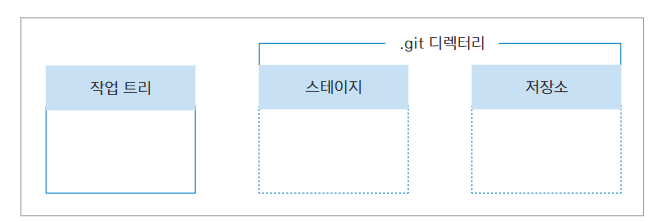

# Git
## 버전 관리
1) git init: 현재 dir에 저장소 만들기, master branch 생성

2) 버전 만들기 

    
    * 작업 트리(working tree)
    * 스테이지(stage): 작업 트리에 있는 파일 중 버전으로 만들 파일이 대기하는 곳
    * 저장소(repository): stage에서 대기하고 있던 파일들을 버전으로 만들어 저장하는 곳

### 파일 상태 알아보기
1) 파일은 크게 tracked과 untracked 파일로 나뉜다.
    * tracked file: 한 번이라도 commit한 파일
    * untracked file

### 작업 되돌리기
1) git restore \<file name>: working directory에서 수정한 내용을 가장 최신 버전으로 되돌리기
    * git restore --staged: staging된 파일을 working directory 상태로 되돌리기

2) git reset HEAD^: HEAD가 가리키는 branch의 최신 commit을 취소.(stage에서도 내려옴)
    * git reset --soft HEAD^: commit을 취소하고 파일을 staged 상태로 보관

3) git reset 해시: 특정 commit(해시)으로 되돌리고 그 이후 버전은 삭제

4) git revert 해시: 특정 commit(해시)을 지우지 않고 변경된 내용만 취소

### Branch
1) git branch: 현재 존재하는 branch 목록 확인하기
     
2) git branch <이름>: <이름>을 가진 branch 생성 

3) git switch <이름>: <이름> branch로 전환하기

4) git branch -d \<branch name>: branch 삭제. 단, 기본 branch(master) 위치에서 다른 branch를 제거할 수 있으며 삭제한 branch를 다시 만들 경우 기존에 있었던 내용들이 그대로 존재한다.

#### Branch merge 
* git merge  \<branch name>: branch name을 현재 branch에 병합. 단, mater branch에서 branch를 분기한 후에 main branch에 아무 변화가 없다면 부기한 branch를 병합하는 것은 쉽다.

1) 서로 다른 branch에서 한 문서의 다른 부분을 수정했을 때 병합하기
    * 그냥 merge 진행해도 아무런 문제가 없음

2) 서로 다른 branch에서 한 문서의 같은 부분을 수정했을 때 병합하기
    * 브랜치 충돌이 발생
    * vim 편집기로 충돌 파일을 열어 충돌 부분을 직접 고쳐주고 commit 해주어야 한다.

* git cherry-pick <체리픽할 해시>: 특정 branch의 특정 버전만 합치게 해준다.

## 백업(Github)
1) 원격 저장소와 지역 저장소 연결
    * git remote add origin \<HTTPS 주소>: 지역 저장소를 원격 저장소에 연결. 이때, origin은 주소의 별칭

    * git remote -v: 현재 연결되어 있는 원격 저장소를 보여줌

2) 처음 원격 저장소에 commit
    * git push -u origin master: 지역 저장소 branch를 원격 저장소(origin) main branch로 push
        * -u: 지역 저장소 branch를 원격 저장소 branch에 연결하기 위한 것으로 처음 한 번만 사용

3) 원격 저장소에 파일 올리기
    * git push: 지역 저장소와 원격 저장소를 연결하여 한 번이라도 push를 진행한 경우 사용

4) 원격 저장소에서 직접 commit하기
    * 원격 저장소에 [Add file] -> [Create new file] 선택

5) 원격 저장소에서 commit 내려받기
    * git pull origin master: 원격 저장소(origin)을 지역 저장소 master branch로 가져오기
        * 원격 저장소와 지역 저장소의 synchronize가 맞지 않을 경우 반드시 맞춰줘야 함
    
        * origin/main: 원격 저장소의 최신 commit이라는 뜻이다.

## 협업
* git clone: 원격 저장소 복제 + 지역 저장소와 자동으로 연결된다.

1) 서로 다른 컴퓨터에서 원격 저장소 함께 사용하기
    * 원격 저장소와 지역 저장소 사이 synchronize를 유지하는 것이 가장 중요

2) 원격 branch 정보 가져오기
    
    * 지역 저장소의 최종 commit이 "create f3.txt" commit이고, 원격 저장소의 최종 commit은 "add d" commit이다.

    * git fetch: 원격 저장소의 정보를 가져온다. 정보를 가져오는 것이지 원격 저장소의 내용을 합치지는 않는다.

    * git diff HEAD origin/master: fetch로 가져온 정보를 이용하여 현재 최신 commit과 원격 저장소에서 가져온 commit의 차이를 보여준다.

    * git merge origin/master: 원격 저장소의 commit을 확인하고 지역 저장소에 합치겠다고 결정
        * git pull 명령어가 git fetch와 git merge 명령어를 합친 것과 같다.

3) 협업의 기본
    * 원격 저장소에서 개인마다 다른 branch를 만들어 push를 한다.

    * 원격 저장소 주인의 허락하에 master branch와 merge를 진행

    * 원격 저장소에 branch를 만들고 같이 작업할 공동 작업자를 \[Settings] -> \[Collaborators] -> \[Add People]에 추가

4) 원격 저장소에서 협업하기
    1. git clone <원격 저장소 주소> \<directory>: 특정 dir에 원격 저장소 연결 + 최신 commit 가져오기
    2. git config user.name <사용자 이름>: commit할 때 사용할 이름과 이메일 주소 설정. 지역 저장소 위치에서 지정해야 한다.
    3. git config user.email <메일 주소>
        * git config --global: 모든 저장소에서 같은 이메일 주소와 이름을 사용
    4. git pull을 통해 항상 최신 버전을 유지
    5. 본인이 작업해야 할 branch로 switch한 후 작업을 진행
    6. git push -u origin <특정 branch>: 원격 저장소의 특정 branch에 push
    7. 원격 저장소에서 [특정 branch] -> \[Contribution] -> \[Open pull request]
    8. 다른 공동 작업자가 \[Pull requests]에서 다른 사람이 pull을 요구한 것을 보고 master branch와 merge할 것인지 결정

## Git bash command
* git status: 현재 git의 상태 공유(어떤 branch에 있는지, commit할 파일이 있는지 ...)

* git add: working tree에 있는 파일을 stage로 옮기기
    * git add .: 수정 또는 새롭게 만들어진 파일을 한꺼번에 stage 영역에 올림

* git commit -m: stage에 있는 파일을 repository에 옮겨 버전 만들기

* git log: repository에 있는 버전 확인

    * git log --stat: commit과 관련된 파일까지 함께 볼 수 있음

    * git log --oneline: 현재 branch의 commit log를 한 줄씩 보여줌

    * git log --oneline --branches: branch 별로 최신 commit 정보를 보여줌

    * git log --oneline --branches --graph: branch와 commit 관계를 그래프 형태로 보여줌

    * git log \<branch name 1>..\<branch name2>: 왼쪽 branch 기준으로 오른쪽 branch와 비교

* git commit -am: stage와 commit을 동시에 수행(단, commit을 한 번이라도 한 파일에만 적용 가능)
    * git commit --amend: 가장 최근에 commit한 파일의 commit message를 수정할 수 있음

* git diff: 수정한 파일이 repository 또는 stage에 있는 파일과의 차이점을 보여줌

* .gitignore: vim을 통해 .gitignore 파일 안에 버전을 관리하지 않을 파일, 폴더 또는 확장자를 입력