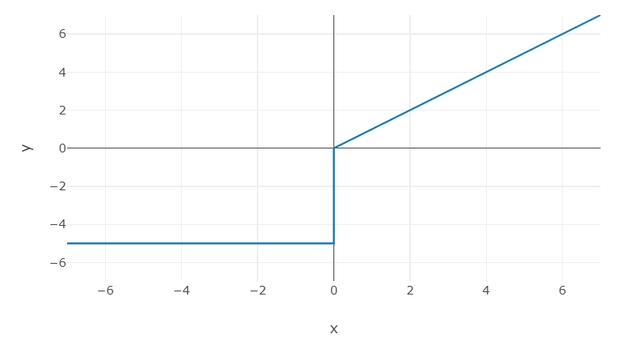
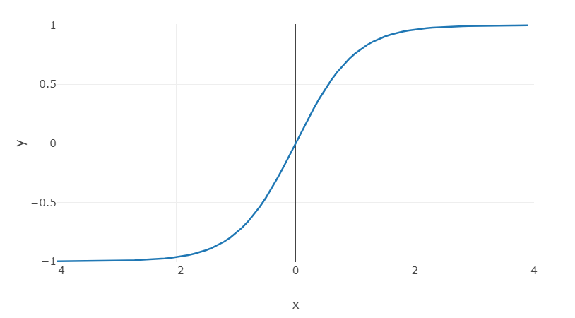
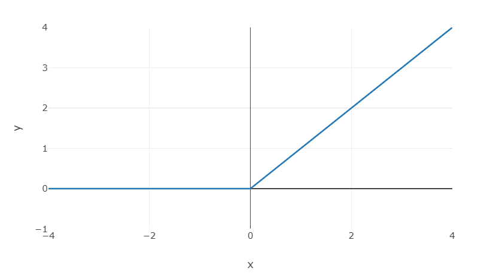
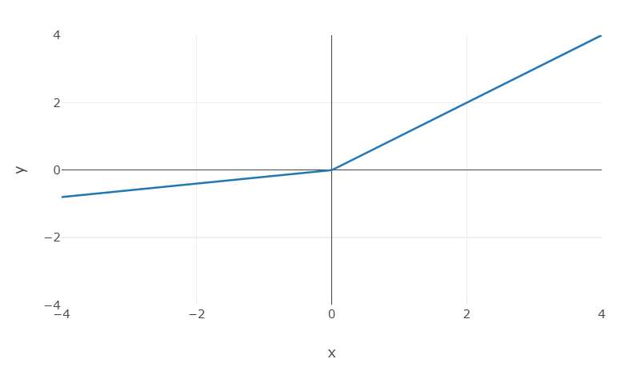
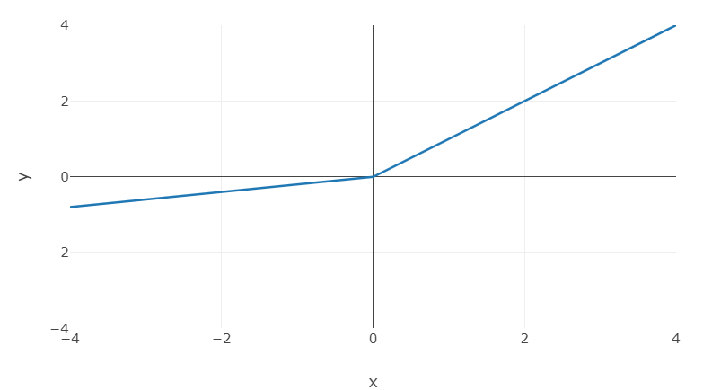
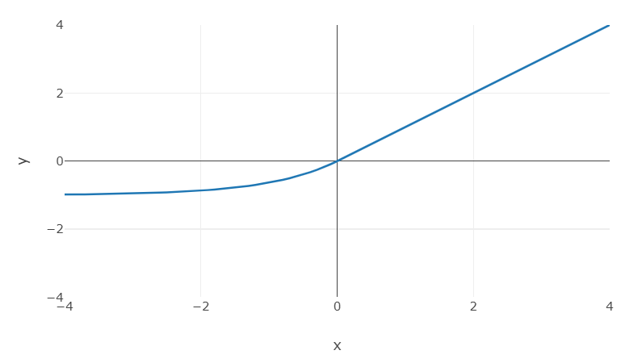

# 파이토치(PyTorch)
* 파이썬용 오픈소스 머신러닝 라이브러리로 동적 계산 그래프 생성(Define-by-Run) 방식을 기반으로 실시간 결괏값을 시각화할 수 있다.

### 텐서(Tensor)
* numpy 라이브러리의 ndarray 클래스와 유사한 구조로 **배열**(Array)이나 **행렬**(Matrix)과 유사한 자료 구조이다.

* 파이토치는 **GPU 가속**(GPU Acceleration)을 적용할 수 있으므로 CPU 텐서와 GPU 텐서로 나눠지고, 각각의 텐서를 상호 변환하거나 GPU 사용 여부를 설정한다.

1. Tensor 생성
    * torch.tensor(): 입력된 데이터를 복사해 텐서로 변환하는 함수로 값이 무조건 존재해야 한다. 주어진 값에 따라 자료형이 결정된다.
    * torch.Tensor(): 텐서의 기본형으로 텐서 인스턴스를 생성하는 클래스이다. 값이 없을 경우 빈 텐서를 생성한다. 기본 유형이 Float로 정수형을 할당하더라도 소수점 형태로 변환된다.
    ```
    print(torch.tensor([1,2,3]))
    print(torch.Tensor([[1,2,3], [4,5,6]]))
    print(torch.LongTensor([1,2,3]))
    print(torch.FloatTensor([1,2,3]))

    # 출력값
    tensor([1, 2, 3])
    tensor([[1., 2., 3.],
            [4., 5., 6.]])
    tensor([1, 2, 3])
    tensor([1., 2., 3.])
    ```

2. Tensor 속성
    * 형태(shape): 텐서의 차원

    * 자료형(dtype): 텐서에 할당된 데이터 형식

    * 장치(device): 텐서의 GPU 가속 여부를 의미


3. 차원 변환
    * **reshape** 메소드를 이용
    ```
    tensor = torch.rand(1,2)    # rand(): 0~1사이의 값을 무작위 추출, (1,2): 생성하려는 텐서의 형태
    print(tensor)
    print(tensor.shape)

    tensor = tensor.reshape(2, 1)
    print(tensor)
    print(tensor.shape)

    # 출력값
    tensor([[0.5684, 0.2008]])
    torch.Size([1, 2])
    tensor([[0.5684],
            [0.2008]])
    torch.Size([2, 1])
    ```


4. 자료형 설정
    * 자료형 설정에 float를 할당해도 되지만 torch.float는 32비트 부동 소수점 형식을 float를 64비트 부동 소수점을 갖기에 torch.*를 사용하므로써 메모리 절약을 할 수 있다.
    ```
    tensor = torch.rand((3,3), dtype=torch.float)
    print(tensor)
    ```

5. 장치 설정
    ```
    device = "cuda" if torch.cuda.is_available() else "cpu"
    cpu = torch.FloatTensor([1,2,3])
    gpu = torch.cuda.FloatTensor([1,2,3])
    tensor = torch.rand((1,1), device=device)
    print(device)
    print(cpu)
    print(gpu)
    print(tensor)

    # 출력값
    cuda
    tensor([1., 2., 3.])
    tensor([1., 2., 3.], device='cuda:0')
    tensor([[0.1495]], device='cuda:0')
    ```

6. 장치 변환
    * CPU 장치를 사용하는 텐서와 GPU 장치를 사용하는 텐서는 상호 간 연산이 불가능하다.

    * CPU 장치를 사용하는 텐서와 numpy 배열 간 연산은 가능하며, GPU 장치를 사용하는 텐서와 numpy 배열 간 연산은 불가능하다. 따라서 numpy 배열 데이터를 학습에 활용하려면 GPU 장치로 변환해야 한다.
    ```
    cpu = torch.FloatTensor([1,2,3])
    gpu = cpu.cuda()
    gpu2cpu = gpu.cpu()
    cpu2gpu = cpu.to("cuda")
    print(cpu)
    print(gpu)
    print(gpu2cpu)
    print(cpu2gpu)

    # 출력값
    tensor([1., 2., 3.])
    tensor([1., 2., 3.], device='cuda:0')
    tensor([1., 2., 3.])
    tensor([1., 2., 3.], device='cuda:0')
    ```

7. 넘파이 배열의 텐서 변환
    ```
    ndarray = np.array([1,2,3], dtype=np.uint8)
    print(torch.tensor(ndarray))
    print(torch.Tensor(ndarray))
    print(torch.from_numpy(ndarray))

    # 출력값
    tensor([1, 2, 3], dtype=torch.uint8)
    tensor([1., 2., 3.])
    tensor([1, 2, 3], dtype=torch.uint8)
    ```

8. 텐서의 넘파이 배열 변환
    * detach: 현재 연산 그래프에서 새로운 텐서를 반환

    * 새로운 텐서를 생성한 후 넘파이 배열로 반환한다. 이때 CPU 장치라면 CPU 장치로 변환한 다음에 넘파이 배열로 변환한다.
    ```
    tensor = torch.cuda.FloatTensor([1,2,3])
    ndarray = tensor.detach().cpu().numpy()
    print(ndarray)
    print(type(ndarray))

    # 출력값
    [1. 2. 3.]
    <class 'numpy.ndarray'>
    ```


### 가설(Hypothesis)
* 가설은 크게 **연구가설(Research Hypothesis)**, **귀무가설(Null Hypothesis)**, **대립가설(Alternative Hypothesis)** 로 나눌 수 있다.
    * 연구가설: 연구자가 검증하려는 가설로 귀무가설을 부정하는 것이다.

    * 귀무가설: 통계학에서 처음부터 버릴 것을 예상하는 가설이다. 변수 간 차이나 관계가 없음을 통계학적 증거를 통해 증명하려는 가설이다.

    * 대립가설: 귀무가설과 반대되는 가설로, 귀무가설이 거짓이라면 대안으로 참이 되는 가설이다. 즉, 대립가설은 연구가설과 동일하다.

1. 머신러닝에서의 가설
    * 독립 변수와 종속 변수 간의 관계를 가장 잘 근사시키기 위해 사용된다.

    * 가설은 **단일 가설(Single Hypothesis)** 과 **가설 집합(Hypothesis Set)** 으로 표현할 수 있다.
        * 단일 가설(h): 입력을 출력에 매핑하고 평가하고 예측하는 데 사용할 수 있는 단일 시스템을 의미한다.

        * 가설 집합(H): 출력에 입력을 매핑하기 위한 **가설 공산(Hypothesis Space)** 으로, 모든 가설을 의미한다.

    * 가설은 회귀 분석과 같은 알고리즘을 통해 최적의 가중치와 편향을 학습을 통해 찾는다. 마지막으로 학습된 결과를 **모델(Model)** 이라 부르며, 이 모델을 통해 새로운 입력에 대한 결괏값을 **예측(Prediction)** 한다.

2. 통계적 가설 검정
    * 대표적인 통계적 가설 검정으로는 **t-검정(t-test)** 가 있으며, **쌍체 t-검정(paired t-test)** 과 **비쌍체 t-검정(unpaired t-test)** 로 세분화할 수 있다.
        * 쌍체 t-검정: 동일한 항목 또는 그룹을 두 번 테스트할 때 사용한다. 예로 동일 잡단에 대한 약물 치료 전후 효과 검정이 있다.

        * 비쌍체 t-검정: 등분산성(homoskedasticity)을 만족하는 두 개의 독립적인 그룹 간의 평균을 비교하는 데 사용한다. 예로 제약 연구에서 서로 다른 두 개의 독립적인 집단(실험군, 대조군) 간에 유의미한 차이가 있는지 조사한다.
    
    * 쌍체 t-검정과 비쌍체 t-검정에는 두 가지 가설이 있다.
        1. 귀무가설: 두 모집단의 평균 사이에 유의한 차이가 없다.

        2. 대립가설: 두 모집단의 평균 사이에 유의한 차이가 있다.
    
    * 머신러닝에서 변수들의 샘플 데이터는 **독립항등분포**를 따르기에 비쌍체 t-검정을 사용해야 한다.


### 손실 함수(Loss Function)
* 실제값과 예측값의 오차가 얼마인지 계산하는 함수를 의미한다. 

* 손실 함수는 **목적 함수(Objective Function)**, **비용 함수(Cost Function)** 라고 부르기도 한다. 목적 함수는 함숫값의 결과를 최댓값 또는 최솟값으로 최적화하는 함수이며, 비용 함수는 전체 데이터에 대한 오차를 계산하는 함수이다. 즉, 손실 함수 ⊂ 비용 함수 ⊂ 목적 함수의 포함 관계를 갖는다.

1. 제곱 오차(Squared Error, SE)
    * 실젯값에서 예측값을 뺀 값의 제곱을 의미
    $$SE = (Y_i - \hat{Y_i})^2$$

2. 오차 제곱합(Sum of Squared for Error, SSE)
    $$SSE = \sum_{i=1}^n(Y_i - \hat{Y_i})^2$$

3. 평균 제곱 오차(Mean Squared Error, MSE)
    * 주로 회귀 분석에서 많이 사용되는 손실 함수
    $$MSE = \frac{1}{n}\sum_{i=1}^n(Y_i - \hat{Y_i})^2$$

4. 교차 엔트로피(Cross-Entropy)
    * **이산형 변수**는 교차 엔트로피가 손실 함수로 사용된다.

    * 교차 엔트로피는 실제값의 확률분포와 예측값의 확률분포 차이를 계산한다.
    $$CE(y,\hat{y}) = -\sum_iy_ilog{\hat{y}_i},\\
     y: 실제\ 확률분포,\ \hat{y}: 예측된\ 확률분포$$


### 최적화(Optimization)
* 목적 함수의 결괏값을 최적화하는 변수를 찾는 알고리즘을 의미한다.

* 최적화 알고리즘은 오차를 줄일 수 있는 가중치와 편향을 계산한다. 

* 최적의 가중치와 편향을 갖는 가설은 오찻값이 0에 가까운 함수가 된다. 이는 가중치와 오차에 대한 도함수의 변화량이 0에 가깝다는 의미다. 다시 말해 가중치와 오차에 대한 그래프의 **극값(Extreme Value)** 이 가설을 가장 잘 표현하는 가중치와 오차가 된다.

1. 경사 하강법(Gradien Descent)
    * 함수의 기울기가 낮은 곳으로 계속 이동시켜 극값에 도달할 때까지 반복하는 알고리즘이다.
    $$W_0 = Initial Value\\
    W_i+1 = W_i - \alpha \nabla f(W_i)$$

    * 가중치 갱신 방법
    $$\hat{Y_i} = W_i\ X\ x\ +\ b_i\\
    MSE(W,b) = \frac{1}{n}\sum_{i=1}^n(Y_i - \hat{Y_i})^2$$

    $$W_{i+1} = W_i - \alpha\frac{\delta}{\delta W}MSE(W,b)\\
    = W_i - \alpha\frac{\delta}{\delta W}\frac{1}{n}\sum_{i=1}^n(Y_i - \hat{Y_i})^2\\
    = W_i - \alpha\frac{\delta}{\delta W}\sum_{i=1}^n[\frac{1}{n}\{Y_i - (W_i\ X\ x\ +\ b_i)\}^2]\\ = W_i - \alpha \ X\ \frac{2}{n}\sum_{i=1}^n[Y_i - (W_i \ X\ x\ + b_i)\ X\ (-x)]\\
    = W_i - \alpha \ X\ \frac{2}{n}\sum_{i=1}^n(Y_i - \hat{Y_i})X(-x) \\
    = W_i - \alpha \ X\ \frac{2}{n}\sum_{i=1}^n(\hat{Y_i} - Y_i)\ X\ x \\
    = W_i - \alpha \ X\ 2E[(\hat{Y_i} - Y_i)\ X\ x]$$

2. 학습률(Learning Rate)
    * 학습률에 따라 다음 가중치의 변화량이 결정되며, 이에 따라 최적의 해를 찾기 위한 반복 횟수가 결정된다.

3. 최적화 문제
    * 기울기가 0이 되는 지점인 극값을 **최댓값(Global Maximum)**, **최솟값(Global Minimum)**, **극댓값(Local Maximun)**, **극솟값(Local Minimun)** 으로 구분할 수 있다. 따라서 학습률을 너무 낮게 잡아도 최적의 가중치를 찾지 못할 수 있다.

    * 경사 하강법 외에도 모멘텀(Momentum), Adagrad(Adaptive Gradient), Adam(Adaptive Moment Estimation) 등 극소 문제와 안장점 문제 등을 해결할 수 있는 최적화 알고리즘 기법들이 존재한다.


### 코드
1. 단순 선형 회귀: 넘파이
```
import numpy as np

x = np.array(
    [[1], [2], [3], [4], [5], [6], [7], [8], [9], [10],
    [11], [12], [13], [14], [15], [16], [17], [18], [19], [20],
    [21], [22], [23], [24], [25], [26], [27], [28], [29], [30]]
)

y = np.array(
    [[0.94], [1.98], [2.88], [3.92], [3.96], [4.55], [5.64], [6.3], [7.44], [9.1],
    [8.46], [9.5], [10.67], [11.16], [14], [11.83], [14.4], [14.25], [16.2], [16.32],
    [17.46], [19.8], [18], [21.34], [22], [22.5], [24.57], [26.04], [21.6], [28.8]]
)

weight = 0.0
bias = 0.0
learning_rate = 0.005

for epoch in range(10000):
    y_hat = weight * x + bias
    cost = ((y - y_hat) ** 2).mean()

    weight = weight - learning_rate * ((y_hat - y) * x).mean()
    bias = bias - learning_rate * (y_hat - y).mean()

    if (epoch + 1) % 1000 == 0:
        print(f"Epoch: {epoch+1:4d}, Weight : {weight:.3f}, Bias : {bias:.3f}, Cost : {cost:.3f}")
```

2. 단순 선형 회귀: 파이토치
    * torch.optim: 최적화 함수가 포함돼 있는 모듈이다.
    * torch.zero(): 0의 값을 값는 텐서를 생성하며 **required_grad** 매개변수를 참으로 설정할 시 모든 텐서에 대한 연산을 추적하며 역전파 메서드를 호출해 기울기를 계산하고 저장한다.
    * optim.SGD: 확률적 경사 하강법으로 모든 데이터에 대해 연산을 진행하지 않고, 일부 데이터만 계산하여 빠르게 최적화된 값을 찾는 방식이다.
    * optimizer.zero_grad(): optimizer 변수에 포함시킨 매개변수들의 기울기를 0으로 최기화한다. 기울기가 weight = x의 형태가 아닌, weight += x의 구조로 저장되기 때문에 기울기를 0으로 최기화해야 한다.
    * cost.backward(): 역전파를 수행. 이 연산을 통해 optimizer 변수에 포함시킨 매개변수들의 기울기가 새로 계산된다.
    * optimizer.step(): 새로 계산된 기울기를 학습률(lr)의 값을 반영한 확률적 경사 하강법 연산이 적용된다.
    ```
    import torch
    from torch import optim

    x = torch.FloatTensor(
        [[1], [2], [3], [4], [5], [6], [7], [8], [9], [10],
        [11], [12], [13], [14], [15], [16], [17], [18], [19], [20],
        [21], [22], [23], [24], [25], [26], [27], [28], [29], [30]]
    )

    y = torch.FloatTensor(
        [[0.94], [1.98], [2.88], [3.92], [3.96], [4.55], [5.64], [6.3], [7.44], [9.1],
        [8.46], [9.5], [10.67], [11.16], [14], [11.83], [14.4], [14.25], [16.2], [16.32],
        [17.46], [19.8], [18], [21.34], [22], [22.5], [24.57], [26.04], [21.6], [28.8]]
    )

    weight = torch.zeros(1, requires_grad=True)
    bias = torch.zeros(1, requires_grad=True)
    learning_rate = 0.001

    optimizer = optim.SGD([weight,bias], lr=learning_rate)

    for epoch in range(10000):
        hypothesis = weight * x + bias
        cost = torch.mean((hypothesis - y) ** 2)

        optimizer.zero_grad()
        cost.backward()
        optimizer.step()

        if (epoch + 1) % 1000 == 0:
            print(f"Epoch: {epoch+1:4d}, Weight : {weight.item():.3f}, Bias : {bias.item():.3f}, Cost : {cost:.3f}")
    ```

3. 신경망 패키지
    * torch.nn에 포함되어 있다.

    * 선형 변환 클래스
        * y = Wx + b 형태의 선형 변환(Linear Transformation)을 입력 데이터에 적용한다.
        * 생성된 인스턴스는 입력 데이터 차원 크기와 동일한 텐서만 입력으로 받을 수 있다. 입력된 텐서는 순방향 연산을 진행해 출력 데이터 차원 크기의 차원으로 반환된다.
    ```
    layer = torch.nn.Linear(
        in_features, # 입력 데이터 차원 크기
        out_features, # 출력 데이터 차원 크기
        bias = True # 계층에 편향 값 포함 여부 결정
        device = None,  # 텐서의 매개변수와 동이한 의미를 가짐
        dtype = None # # 텐서의 매개변수와 동이한 의미를 가짐
    )
    ```

    ```
    # weight = torch.zeros(1, requires_grad=True)
    # bias = torch.zeros(1, requires_grad=True)
    # 입출력 데이터 차원 크기 매개변수가 weight 변수를 대체, bias 매개변수가 bias 변수 대체
    import torch
    from torch import nn
    from torch import optim

    x = torch.FloatTensor(
        [[1], [2], [3], [4], [5], [6], [7], [8], [9], [10],
        [11], [12], [13], [14], [15], [16], [17], [18], [19], [20],
        [21], [22], [23], [24], [25], [26], [27], [28], [29], [30]]
    )

    y = torch.FloatTensor(
        [[0.94], [1.98], [2.88], [3.92], [3.96], [4.55], [5.64], [6.3], [7.44], [9.1],
        [8.46], [9.5], [10.67], [11.16], [14], [11.83], [14.4], [14.25], [16.2], [16.32],
        [17.46], [19.8], [18], [21.34], [22], [22.5], [24.57], [26.04], [21.6], [28.8]]
    )

    model = nn.Linear(1, 1)
    criterion = nn.MSELoss()
    optimizer = optim.SGD(model.parameters(), lr=0.001)

    for epoch in range(10000):
        output = model(x)
        cost = criterion(output, y)

        optimizer.zero_grad()
        cost.backward()
        optimizer.step()

        if (epoch + 1) % 1000 == 0:
            print(f"Epoch: {epoch+1:4d}, Model : {list(model.parameters())}, Cost : {cost:.3f}")
    ```


### 데이터세트(Dataset)와 데이터로더(DataLoader)
1. 데이터세트
    * 학습에 필요한 데이터 샘플을 정제하고 정답을 저장하는 기능을 제공한다.

    * 클래스로 제공되며, **초기화 메서드(_\_init__)**, **호출 메서드(__getitem__)**, **길이 반환 메서드(__len__)** 를 재정의하여 활용한다.

    * 데이터세트 클래스 기본형
        * 초기화 메서드: 입력된 데이터의 전처리 과정을 수행하는 메서드이다.
        * 호출 메서드: 학습을 진행할 때 사용되는 하나의 행을 불러오는 과정
        * 길이 변환 메서드: 학습에 사용된 전체 데이터세트의 개수를 반환
    ```
    class Dataset:
        def __init__(self, data, *arg, **kwargs):
            self.data = data

        def __getitem__(self, index):
            return tuple(data[index] for data in data.tensors)

        def __len__(self):
            return self.data[0].size(0)
    ```

2. 데이터로더
    * 데이터세트에 저장된 데이터를 어떠한 방식으로 불러와 활용할지 정의한다.

    * **배치 크기(batch_size)**, **데이터 순서 변경(shuffle)**, **데이터 로드 프로세스 수(num_workers)** 등의 기능을 제공한다.
        * 배치 크기: 데이터의 개수가 많아 메모리에 올릴 수 없을 때 데이터를 나누는 역할을 한다.
        * 데이터 순서 변경: 모델이 데이터 간의 관계가 아닌, 데이터의 순서로 학습되는 것을 방지하고자 수행하는 기능이다.
        * 데이터 로드 프로세스 수: 데이터를 불러올 때 사용할 프로세스의 개수를 의미한다.

3. 다중 선형 회귀
    * **TensorDataset** 은 기본 Dataset 클래스를 상속받아 재정의된 클래스다.

    * 다중 선형 회귀도 선형 변환 클래스를 사용한다.
    ```
    import torch
    from torch import nn
    from torch import optim
    from torch.utils.data import TensorDataset, DataLoader

    train_x = torch.FloatTensor([
        [1,2], [2,3], [3,4], [4,5], [5,6], [6,7]
    ])
    train_y = torch.FloatTensor([
        [0.1,1.5], [1,2.8], [1.9,4.1], [2.8,5.4], [3.7,6.7], [4.6,8]
    ])

    train_dataset = TensorDataset(train_x, train_y)
    # shuffle: 불러오는 데이터의 순서를 무작위로 변경, drop_last: 배치 크기에 맞지 않는 배치를 제거
    train_dataloader = DataLoader(train_dataset, batch_size=2, shuffle=True, drop_last=True)

    model = nn.Linear(2, 2, bias=True)
    critertion = nn.MSELoss()
    optimizer = optim.SGD(model.parameters(), lr=0.001) 

    for epoch in range(20000):
        cost = 0.0

        for batch in train_dataloader:
            x, y = batch
            output = model(x)

            loss = criterion(output, y)

            optimizer.zero_grad()
            loss.backward()
            optimizer.step()

            cost += loss

        cost = cost / len(train_dataloader)

        if (epoch + 1) % 1000 == 0:
            print(f"Epoch: {epoch+1:4d}, Model : {list(model.parameters())}, Cost : {cost:.3f}")
    ```


### 모델
1. 모듈 클래스
    *  새로운 모델 클래스를 생성하려면 모듈 클래스를 상속받아 임의의 서브 클래스를 생성한다.

    * 모듈 클래스는 초기화 메서드(\__init__)와 순방향 메서드(forward)를 재정의하여 활용한다. 초기화 메서드에는 신경망에 사용될 계층을 초기화하고, 순방향 메서드에서는 모델이 어떤 구조를 갖게 될지를 정의한다.

    * 모델 객체를 호출하는 순간 순방향 메서드가 실행된다.
    ```
    # 모듈 클래스의 기본형
    class Model(nn.Modul):
        def __init__(self):
            super().__init__()
            self.conv1 = nn.Conv2d(1, 20, 5)
            self.conv2 = nn.Conv2d(20, 20, 5)

        def forward(self, x):
            x = F.relu(self.conv1(x))
            x = F.relu(self.conv2(x))
            return x
    ```

    * 초기화 메서드에서 계층을 정의하기 전에 super 함수로 모듈 클래스(부모 클래스)를 초기화 한다. 그 결과 서브 클래스인 모델에서 부모 클래스의 속성을 사용할 수 있다. 모델 클래스 초기화 이후, 학습에 사용되는 계층을 초기화 메서드에 선언한다. self.conv1, self.con2와 같은 인스턴스가 모델의 매개변수가 된다.

    * 순방향 메서드는 초기화 메서드에서 선언한 모델 매개변수를 활용해 신경망 구조를 설계한다. 모델이 데이터(x)를 입력받아 학습을 진행하는 일련의 과정을 정의하는 영역이다.

2. 비선형 회귀
    * 비선형 회귀 구현을 위한 라이브러리 및 프레임워크 초기화
    ```
    import torch
    import pandas as pd
    from torch import nn
    from torch import optim
    from torch.utils.data import Dataset, DataLoader
    ```

    * 사용자 정의 데이터세트 선언
    ```
    class CustomDataset(Dataset):
        def __init__(self, file_path):
            df = pd.read_csv(file_path)
            self.x = df.iloc[:, 0].values
            self.y = df.iloc[:, 1].values
            self.length = len(df)

        def __getitem__(self, index):
            x = torch.FloatTensor([self.x[index] ** 2, self.x[index]])
            y = torch.FloatTensor([self.y[index]])
            return x, y

        def __len__(self):
            return self.length
    ```

    * 사용자 정의 모델 선언
    ```
    class CustuomModel(nn.Module):
        def __init__(self):
            super().__init__()
            self.layer = nn.Linear(2, 1) # 입력 데이터 차원 크기, 출력 데이터 차원 크기

        def forward(self, x):
            x = self.layer(x)
            return x;
    ```

    * 사용자 정의 데이터세트와 데이터로더
    ```
    train_dataset = CustomDataset("../datasets/non_linear.csv")
    train_dataloader = DataLoader(train_dataset, batch_size=128, shuffle=True, drop_last=True)
    ```

    * GPU 연산 적용
        * to() 메서드를 이용해 해당 클래스가 어떤 장치를 사용해 연산을 진행할지 설정할 수 있다.
    ```
    device = "cuda" if torch.cuda.is_available() else "cpu"
    model = CustomModel().to(device)
    criterion = nn.MSELoss().to(device)
    optimizer = optim.SGD(model.parameters(), lr=0.0001)
    ```

    * 학습 진행
    ```
    for epoch in range(10000):
        cost = 0.0

        for x, y in train_dataloader:
            x = x.to(device)
            y = y.to(device)

            output = model(x)
            loss = criterion(output, y)

            optimizer.zero_grad()
            loss.backward()
            optimizer.step()

            cost += loss

        cost = cost / len(train_dataloader)

        if (epoch + 1) % 1000 == 0:
            print(f"Epoch: {epoch+1:4d}, Model : {lost(model.parameters())}, Cost : {cost:.3f}")
    ```

3. 모델 평가
    * 테스트 데이터세트나 임의의 값으로 모델을 확인하거나 평가할 때는 **torch.no_grad** 클래스를 활용한다. no_grad 클래스는 기울기 계산을 비활성화하는 클래스이다.
    * 모델 평가 모드는 **eval** 메서드로 변경할 수 있다. 평가 모드를 진행한 다음 다시 학습을 진행하려는 경우 **train** 메서드를 통해 학습 모드로 변경해야 한다.
    ```
    with torch.no_grad():
        model.eval()
        inputs = torch.FloatTensor(
            [
                [1 ** 2, 1],
                [5 ** 2, 5],
                [11 ** 2, 11],
            ]
        ).to(device)
        outputs = model(inputs)
        print(outputs)
    ```

    1. 모델 저장 방법
    ```
    torch.save(
        model,
        "../models/model.pt"
    )

    torch.save(
        model.state_dict(),
        "../models/model_state_dict.pt"
    )
    ```

### 데이터세트 분리
* 머신러닝에서 사용되는 **전체 데이터세트(Original Dataset)** 은 두 가지 또는 세 가지로 나눌 수 있다. 전체 데이터세트는 **훈련용 데이터(Training Data)**, **테스트 데이터(Test Data)** 로 분류되고, 더 세분화하면 **검증 데이터(Validation Data)** 까지 분리해 활용한다.
    * 검증용 데이터: 학습이 완료된 모델을 검증하기 위해 사용되는 데이터세트다. 주로 구조가 다른 모델의 성능 비교를 위해 사용되는 데이터세트를 의미한다.
```
import torch
import pandas as pd
from torch import nn
from torch import optim
from torch.utils.data import Dataset, DataLoader, random_split

# 중략

dataset = CustomDataset("../datasets/non_linear.csv")
dataset_size = len(dataset)
train_size = int(dataset_size * 0.8)
validation_size = int(dataset_size * 0.1)
test_size = dataset_size - train_size - validation_size

train_dataset, validation_dataset, test_dataset = random_split(dataset, [train_size, validation_size, test_size])

train_dataloader = DataLoader(train_dataset, batch_size=16, shuffle=True, drop_last=True)
validation_dataloader = DataLoader(validation_dataset, batch_size=4, shuffle=True, drop_last=True)
test_dataloader = DataLoader(test_dataset, batch_size=4, shuffle=True, drop_last=True)

# 중략

with torch.no_grad():
    model.eval()
    for x, y in validation_dataloader:
        x = x.to(device)
        y = y.to(device)

        outputs = models(x)
        print(f"X : {x}")
        print(f"Y : {y}")
        print(f"Outputs : {outputs}")
```

* torch.utils.data 모듈의 무작위 분리(random_split) 함수
    * 무작위 분리 함수는 분리 길이(lengths)만큼 데이터세트의 subset을 생성한다. 분리 길이는 정수형 시퀀스(list)를 입력한다. 이때, 입력한 데이터세트의 개수와 분리 길이의 총합이 같아야 한다.

    * 생성자(generator)는 subset에 포함될 무작위 데이터들의 나수 생성 시드를 의미한다. 랜덤 시드는 torch.manual_seed(int) 함수를 사용해 무작위성을 결정할 수 있다.
```
subset = torch.utils.data.random_split(
    dataset,
    lengths,
    generator
)
```


### 모델 저장 및 불러오기
* 파이토치의 모델은 **직렬화(Serialize)** 와 **역직렬화(Deserialize)** 를 통해 객체를 저장하고 불러올 수 있다.

* 모델을 저장하려면 파이썬의 **Pickle**을 활용해 파이썬 객체 구조를 **Binary Protocols**로 직렬화한다. 모델에 사용된 텐서나 매개변수를 저장한다.

* 모델을 불러오려면 저장된 객체 파일을 역직렬화해 현재 프로세스의 메모리에 업로드한다.

* 모델 파일 확장자는 주로 **.pt**나 **.pth**로 저장한다.

1. 모델 전체 저장/불러오기
    * 모델 전체를 저장하는 경우 모델 클래스의 구조와 학습 상태 등을 모두 저장한다.
    ```
    # 모델 저장 함수
    torch.save(
        model,
        path
    )
    ```

    * map_location 매개변수는 모델을 불러올 때 적용하려는 장치 상태(cpu인지 gpu인지)를 의미한다.
    ```
    # 모델 불러오기 함수
    model = torch.load(
        path,
        map_location
    )
    ```

    * 모델을 불러올 때 동일한 형태의 클래스(CustomModel)가 선언돼 있어야 한다. 없을 시 AttributeError 오류가 발생한다.

    ```
    class CustomModel(nn.Module):
        def __init__(self):
            super().__init__()
            self.layer = nn.Linear(2, 1) # 입력 데이터 차원 크기, 출력 데이터 차원 크기

        def forward(self, x):
            x = self.layer(x)
            return x;

    device = "cuda" if torch.cuda.is_available() else "cpu"
    model = torch.load("../models/model.pt", map_location=device)
    ```

    * 모델 전체 파일은 가지고 있으나 모델 구조를 알 수 없는 경우 모델 구조를 출력해 확인할 수 있다. 모델 구조 확인을 통해 모델을 구현하면 되는데 이때, 변수의 명칭(layer)까지 동일한 형태로 구현해야 한다.
    ```
    class CustomModel(nn.Module):
        pass

    device = "cuda" if torch.cuda.is_avialable() else "cpu"
    model = torch.load("../models/model.pt", map_location=device)
    print(model)

    # 출력값
    CustomModel(
        (layer): Linear(in_features=2, out_features=1, bias=True)
    )
    ```

2. 모델 상태 저장/불러오기
    * 모델의 매개변수만 저장하는 것으로, **모델 상태**(torch.state_dict)는 모델에서 학습이 가능한 매개변수를 **순서가 있는 딕셔너리**(OrderedDict) 형식으로 반환한다.
    ```
    # 모델 상태 저장
    torch.save(
        model.state_dict()
        "../models/model_state_dict.pt"
    )

    # 출력값
    OrderedDict(
        [
            (
                'layer.weight', tensor([[3.1076, -1.7026]], device='cuda:0')
            ),
            (
                'layer.bias', tensor([0.0293]m device='cuda:0')
            )
        ]
    )
    ```

    * 모델 상태만 불러오면 모델 구조를 알 수 없으므로 CustomModel 클래스가 구현돼 있어야 한다.
    ```
    # 모델 상태 불러오기
    import torch
    from torch import nn

    class CustomModel(nn.Module):
    def __init__(self):
        super().__init__()
        self.layer = nn.Linear(2, 1) # 입력 데이터 차원 크기, 출력 데이터 차원 크기

    def forward(self, x):
        x = self.layer(x)
        return x;

    device = "cuda" if torch.cuda.is_avialable() else "cpu"
    model = CustomModel().to(device)

    model_state_dict = torch.load("../models/model_state_dict.pt", map_location=device)
    model.load_state_dict(model_state_dict)
    ```

3. 체크포인트 저장/불러오기
    * 학습 과정의 특정 지점마다 저장하는 것을 의미한다.
    ```
    # 체크포인트 저장
    import torch
    import pandas as pd
    from torch import nn
    from torch import optim
    from torch.utils.data import Dataset, DataLoader

    # 중략

    checkpoint = 1
    for epoch in range(10000):
    # 중략

        cost = cost / len(train_dataloader)

        if (epoch + 1) % 1000 == 0:
            torch.save(
                {
                    "model": "CustomModel",
                    "epoch": epoch,
                    "model_state_dict": model.state_dict(),
                    "optimizer_state_dict": optimizer.state_dict(),
                    "cost": cost,
                    "description": f"CustomModel 체크포인트-{checkpoint}",
                },
                f"../models/checkpoint-{checkpoint}.pt"
            )
            checkpoint += 1
    ```
    ```
    # 체크포인트 불러오기
    checkpoint = torch.load("../models/checkpoint-6.pt")
    model.load_state_dict(checkpoint["model_state_dict"])
    optimizer.load_state_dict(checkpoint["optimizer_state_dict"])
    checkpoint_epoch = checkpoint["epoch"]
    checkpoint_description = checkpoint["description"]
    print(checkpoint_description)

    for epoch in range(checkpoint_epoch + 1, 10000):
        cost = 0.0

        for x, y in train_dataloader:
            x = x.to(device)
            y = y.to(device)
            # 생략
    ```

### 활성화 함수(Activation Function)
* 은닉층을 활성화하기 위한 함수로 가중치와 편향으로 이루어진 노드를 선형에서 비선형으로 갱신하는 역할을 한다.

* 활성화 함수는 **비선형 구조**를 가져 역전파 과정에서 미분값을 통해 학습이 진행될 수 있게 한다.

1. 이진 분류
    * 입력된 값을 두 그룹으로 분류하는 작업을 의미한다. 분류 결과가 맞으면 1을 아니면 0을 반환한다.

2. 시그모이드 함수(Sigmoid Function)
    * 반환값은 0~1 또는 -1~1의 범위를 갖는다.

    * x의 계수가 0에 가까워질수록 완만한 경사를, 0에 멀어질수록 급격한 경사를 갖게 된다.
    
    * 시그모이드 함수는 주로 **로지스틱 회귀**(Logistic Regression)에 사용된다. 로지스틱 회귀는 독릭 변수(X)의 선형 결합을 활용하여 결과를 특정 분류로 예측한다.
    
    * 시그모이드 함수를 사용하면 **기울기 소실**(Vanishing Gradient) 문제를 일으킨다. 이는 계층이 많아지면 점점 값이 0에 수렴하는 문제가 발생한다.
    $$Sigmoid(x) = \frac{1}{1+e^{-x}}$$

3. 이진 교차 엔트로피(Binary Cross Entropy, BCE)
    * 평균 제곱 오차를 이진 분류에 사용하면 예측값과 실제값의 차이가 작으면 계산되는 오차 또한 크기가 작아져 학습을 원할하게 진행하기 어렵다. 이를 방지하고자 이진 교차 엔트로피를 오차 함수로 사용한다.

    * 로그 함수는 0에 가까울수록 무한대로 발산하는 특징이 있다. 따라서 로그 함수의 경우 불일치의 비중이 높을 수록 **높은 손신 값**을 반환한다.
    $$BCE = -\frac{1}{N}\sum_{i=1}^N (y_ilog\hat{y_i} + (1 - y_i)log(1-\hat{y_i}))$$

```
# 입력 차원이 3차원, 출력 차원이 1차원 그 후 시그모이드 함수를 활용한 모델
# Sequential을 활용해 여러 계층을 하나로 묶을 수 있으며 묶은 계층은 순차적으로 실행된다.
class CustomModel(nn.Module):
    def __init__(self):
        super().__init__()
        self.layer = nn.Sequential(
            nn.Linear(3, 1)
            nn.Sigmoid()
        )

    def forward(self, x):
        x = self.layer(x)
        return x

# 손실 함수는 이진 교차 엔트로피를 사용한다.
criterion = nn.BCELoss().to(device)
```

### 비선형 활성화 함수
1. 계단 함수(Step Function)
    * 임곗값에서 **불연속점**을 가지므로 미분이 불가능해 학습을 진행할 수 없다.
    $$Step(x) = \begin{cases}
    0,\;if\;x<0\\
    1,\;if\;x\geq0
    \end{cases}$$

2. 임곗값 함수(Threshold Function)
    * 임곗값보다 크면 입력값(x)을 그대로 전달하고, 임곗값보다 작으면 특정 값(value)으로 변경한다.
    $$Threshold(x) = \begin{cases}
    x,\;if\;x>threshold\\
    value,\;otherwise
    \end{cases}$$
    

3. 시그모이드 함수(Sigmoid Function)
    * 기울기 소실로 인해 시그모이드 함수는 은닉층에서 활성화 함수로 사용하지 않고 주로 출력층에서만 사용한다.

    * 출력값의 중심이 0이 아니다.

4. 하이퍼볼릭 탄젠트 함수(Hyperbolic Tangent Function)
    * 출력값의 중심이 0이며, 출력값이 -1~1의 범위를 가진다.

    * 여전히 기울기 소실에 대한 문제가 발생한다.
    $$Tanh(x) = \frac{e^x - e^{-x}}{e^x + e^{-x}}$$
    

5. ReLU 함수(Rectified Linear Unit Function)
    * 0보다 작거나 같으면 0을 반환하며, 0보다 크면 선형 함수에 값을 대입하는 구조를 갖는다.

    * 시그모이드 또는 하이퍼블릭 탄젠트 함수와 다르게 ReLU 함수는 입력값이 양수라면 출력값이 제한되지 않아 기울기 소실이 발생하지 않는다.

    * 입력값이 음수인 경우 항상 0을 반환하므로 가중치나 편향이 갱신되지 않을 수 있다. 가중치 합이 음수가 되면, 해당 노드는 더 이상 값을 갱신하지 않아 **죽은 뉴런**(Dead Neuron, Dying ReLU)이 된다.
    $$ReLU(x) = \begin{cases}
    x,\;if\;x>0\\
    0,\;otherwise
    \end{cases}$$
    

6. LeakyReLU 함수(Leaky Rectified Linear Unit Function)
    * 음수 기울기를 제어하여, 죽은 뉴런 현상을 방지하기 위해 사용한다.
    $$LeakyReLU(x) = \begin{cases}
    x,\;if\;x>0\\
    negatie_slope\ X\ x,\;otherwise
    \end{cases}$$
    

7. PReLU(Parametric Rectified Linear Unit Function)
    * LeakyReLU 함수와 동일하지만 음수 기울기 값을 고정값이 아닌, 학습을 통해 갱신되는 값으로 갖누한다. 즉, 함수의 음수 기울기(a)는 지속해서 값이 변경된다.

    * 값이 지속해서 갱신되는 매개변수이므로, 학습 데이터세트에 영향을 받는다.
    $$PReLU(x) = \begin{cases}
    x,\;if\;x>0\\
    a\ X\ x,\;otherwise
    \end{cases}$$
    

8. ELU 함수(Exponential Linear Unit Function)
    * 지수 함수를 사용하여 부드러운 곡선의 형태를 갖는다.

    * 기존 ReLU 함수와 변형 ReLU 함수는 0에서 끊어지는데, ELU 함수는 음의 기울기에서 비선형 구조를 갖는다. 그러므로 입력값이 0인 경우에도 출력값이 급변하지 않는다.
    $$ELU(x) = \begin{cases}
    x,\;if\;x>0\\
    negative\_slope\ X\ (e^x - 1),\;otherwise
    \end{cases}$$
    

9. 소프트맥스 함수(Softmax Function)
    * 차원 벡터에서 특정 출력값이 k 번째 클래스에 속할 확률을 구한다.

    * 클래스에 속할 확률을 계산하는 활성화 함수로 은닉층이 아닌 출력층에 사용된다. 즉, 네트워크의 출력을 가능한 클래스에 대한 **확률 분포**로 매핑한다.
    $$p_k = \frac{e^{zk}}{\sum_{i=1}^{n}e^{zi}}$$


### 순전파와 역전파
1. 순전파(Forward Propagation)
    * 순반향 전달(Forward Pass)이라고도 하며 입력이 주어지면 신경망의 출력을 계산하는 프로세스다.
    $$\hat{y} = activation(weight\ X\ x\ +\ bias)$$

2. 역전파(Back Propagation)
    * 순전파 방향과 반대로 연산이 진행된다. 역전파 과정에서는 각각의 가중치와 편향을 최적화하기 위해 **연쇄 법칙**을 활용한다.

```
class CustomModel(nn.Module):
  def __init__(self):
    super().__init__()

    self.layer1 = nn.Sequential(
        nn.Linear(2,2),
        nn.Sigmoid()
    )
    self.layer2 = nn.Sequential(
        nn.Linear(2,1),
        nn.Sigmoid()
    )

    self.layer1[0].weight.data = torch.nn.Parameter(
        torch.Tensor([[0.4352, 0.3545],
                      [0.1951, 0.4835]])
    )

    self.layer1[0].bias.data = torch.nn.Parameter(
        torch.Tensor([-0.1419, 0.0439])
    )

    self.layer2[0].weight.data = torch.nn.Parameter(
        torch.Tensor([[-0.1725, 0.1129]])
    )

    self.layer2[0].bias.data = torch.nn.Parameter(
        torch.Tensor([-0.3043])
    )

device = "cuda" if torch.cuda.is_available() else "cpu"
model = CustomModel().to(device)
criterion = nn.BCELoss().to(device)
optimizer = optim.SGD(model.parameters(), lr=1)
```

3. 순전파 계산
    * 첫 번째 계층의 가중합(Weighted Sum)을 계산
    $$z_1 = W_1x_1\ +\ W_2x_2\ +\ b_1\\
    = 0.4352\ X\ 1\ +\ 0.3545\ X\ 1\ -\ 0.1419\\
    = 0.6478 $$

    $$z_2 = W_3x_1\ +\ W_4x_2\ +\ b_2\\
    = 0.1951\ X\ 1\ +\ 0.4835\ X\ 1\ -\ 0.0439\\
    = 0.7225 $$

    * 첫 번째 계층의 가중합을 활성화 함수에 대입
    $$\sigma _1 = \frac{1}{1+e^{-z_1}}\\
    = \frac{1}{1+e^{-0.6478}}\\
    = 0.6565$$

    $$\sigma _2 = \frac{1}{1+e^{-z_2}}\\
    = \frac{1}{1+e^{-0.7225}}\\
    = 0.6732$$

    * 두 번째 계층의 가중합과 활성화 함수 대입
    $$z_3 = W_5\sigma _1\ +\ W_6\sigma _2\ + b_3\\
    = -0.1725\ X\ 0.6565\ +\ 0.1129\ X\ 0.6732\ +\ -0.3043\\
    = -0.3415$$

    $$\sigma _3 = \frac{1}{1+e^{-z_3}}\\
    = \frac{1}{1+e^{0.3415}}\\
    = 0.4154$$

4. 오차 계산
    * 실제값(y=0)과 예측값으로 오차 계산
    $$L = -(y_ilog\hat{y_i} + (1 - y_i)log(1-\hat{y_i}))\\
    = -(0log(0.4154)\ +\ (1-0)log(1 - 0.4154))\\
    = -log0.5846 = 0.5368$$

5. 역전파 계산
    * 계층의 역순으로 가중치와 편향을 갱신한다. 즉, W5, W6, b3를 갱신한 다음에 W1, W2, W3, W4, b1, b2가 갱신된다.

    * 모델의 학습은 오차가 작아지는 방향으로 갱신돼야 하기 때문에 **미분값이 0**에 가까워져야 한다.
    $$W_n(t+1) = W_n - \alpha\frac{\delta L}{\delta W_n(t)}$$
    ---
    $$W_5(2) = W_5(1) - \alpha\frac{\delta L}{\delta W_5(1)}\\
    = -0.1725\ -\ \alpha\frac{\delta L}{\delta W_5(1)}$$
    ---
    $$\frac{\delta L}{\delta W_5(1)} = \frac{\delta L}{\delta \sigma _3}\ X\ \frac{\delta \sigma _3}{\delta z_3}\ X\ \frac{\delta z_3}{\delta W_5(1)}\\
    = 1.7106\ X\ 0.2428\ X\ 0.6565\\
    = 0.2727$$
    ---
    $$\frac{\delta L}{\delta \sigma _3} = -\frac{\delta}{\delta \sigma _3}(ylog\hat{y} + (1 - y)log(1-\hat{y}))\\
    = -\frac{\delta}{\delta \sigma _3}(ylog(\sigma _3) + (1 - y)log(1-\sigma _3))\\
    =-(\frac{y}{\sigma _3} - \frac{1-y}{1-\sigma _3})\\
    = \frac{\sigma _3 - y}{\sigma _3(1-\sigma _3)}\\
    = \frac{\sigma _3}{\sigma _3(1-\sigma _3)} \\
    = \frac{0.4154}{0.4154(1-0.4154)}\\
    = 1.7106$$
    ---
    $$\frac{\delta \sigma _3}{\delta z_3} = \frac{\delta}{\delta z_3}(\frac{1}{1+e^{-z_3}})\\
    = \frac{e^{-z_3}}{(1+e^{-z_3})^2}\\
    = \frac{1}{1+e^{-z_3}}\ X\ (1 - \frac{1}{1+e^{-z_3}})\\
    = \sigma _3\ X\ (1 - \sigma _3)\\
    = 0.2428$$
    ---
    $$\frac{\delta z_3}{\delta W_5(1)} = \frac{1}{\delta W_5(1)}(W_5\sigma _1\ +\ W_6\sigma _2\ + b_3)\\
    =\sigma _1\\
    = 0.6565$$
    ---
    $$W_5(2) = W_5(1) - \alpha \frac{\delta L}{\delta W_5(1)}\\
    = -0.1725\ -\ \frac{\delta L}{\delta W_5(1)}\\
    = -0.1725\ -\ 0.2727\\
    = -0.4452$$

    * 위와 동일한 방법으로 W6와 b3를 갱신할 수 있다. 첫 번째 계층의 파라미터인 W1, W2, W3, W4와 b1, b2도 비슷하다.
    $$W_1(2) = W_1(1) - \alpha \frac{\delta L}{\delta W_1(1)}\\
    = W_1(1) - \frac{\delta L}{\delta \sigma _1}\ X\ \frac{\delta \sigma _1}{\delta z_1}\ X\ \frac{\delta z_1}{\delta W_1(1)}$$
    ---
    $$\frac{\delta L}{\delta \sigma _1} = \frac{\delta L}{\delta \sigma _3}\ X\ \frac{\delta \sigma _3}{\delta z_3}\ X\ \frac{\delta z_3}{\delta \sigma _1}$$


### 퍼셉트론(Perceptron)
* 퍼셉트론은  **TLU**(Threshold Logic Unit) 형태를 기반으로 하며, **계단 함수**를 적용해 결과를 반환한다. 즉, 입력값과 노드의 가중치를 곱한 값을 모두 더했을 때 임곗값보다 크면 1을 출력하고, 작으면 0을 출력한다.

1. 단층 퍼셉트론(Single Layer Perceptron)
    * 하나의 계층을 갖는 모델로 전달된 입력값(x)과 가중치를 곱한 값이 활성화 함수에 전달된다.

    * XOR 게이트를 하나의 기울기로 표현하기 어렵다는 한계가 있다.

2. 다층 퍼셉트론(Multi-Layer Perceptron, MLP)
    * 단층 퍼셉트론을 여러 개 쌓아 은닉층을 생선한 것으로 은닉층이 2개 이상 연결한다면 **심층 신경망**(Deep Neural Network, DNN)이라 부른다.