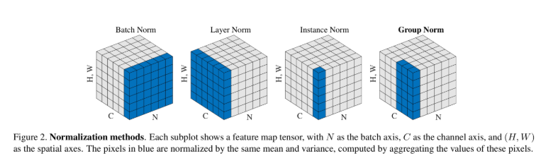

# 파이토치(PyTorch, 심화)

### 과대적합과 과소적합
* 과대적합(Overfitting): 모델이 훈련 데이터에만 적합하게 학습되어 새로운 데이터에 대해서는 성능이 저하되는 경우

* 과소적합(Underfitting): 훈련 데이터에서도 성능이 좋지 않고 새로운 데이터에서도 성능이 좋지 않은 경우

* 공통점
    * 성능 저하

    * 모델 선택 실패: 과대적합은 모델이 너무 복잡해서, 과소적합은 모델이 너무 단순해서 발생한다. 따라서 모델을 변경하거나 모델 구조를 개선해야 한다.

    * 편향-분산 트레이드오프: 모델은 낮은 편향과 낮은 분산이 가장 이상적인 형태이다. 분산이 높으면 추정치에 대한 변동 폭이 커지며, 데이터가 갖고 있는 노이즈까지 학습해 과대적합 문제를 발생시킨다. 편향이 높으면 추정치가 항상 일정한 값을 갖게 될 확률이 높아져 데이터의 특징을 제대로 학습하지 못해 과소적합 문제를 발생시킨다.


### 배치 정규화(Batch Normalization)
* 내부 공변량 변화(Internal Covariate Shift)를 줄여 과대적합을 방지하는 기술이다. 내부 공변량 변화란 모델이 배치 단위로 나눠 학습할 때 계층마다 입력 분포가 변경되는 현상을 의미한다.

* 내부 공변량 변화가 발생하는 경우 은닉층에서 다음 은닉층으로 전달될 때 입력값이 균일해지지 않아 가중치가 제대로 갱신되지 않을 수 있다. 또한 초기 가중치 값에 민감해져 일반화하기가 어려워져 더 많은 학습 데이터를 요구한다. 이러한 문제를 해결하기 위해 **배치 정규화**를 적용한다.

* 배치 정규화를 적용하면 각 계층에 대한 입력이 일반화되고 독립적으로 정규화가 수행되므로 더 빠르게 값을 수렴할 수 있다.

* 정규화 종류
    * 배치 정규화 외에 계층 정규화(Layer Normalization), 인스턴스 정규화(Instance Normalization), 그룹 정규화(Group Normalization)가 있다.
    

    * **차원**(Dimensions, H.W)은 이미지 데이터의 크기(너비, 높이)나 어휘 사전의 크기가 된다. **채널**(Channels)의 경우 이미지 데이터의 채널이나 시간 간격(Timestep)으로 볼 수 있다.

    1\) 배치 정규화
    * 미니 배치에서 계산된 평균 및 분산을 기반으로 계층의 입력을 정규화한다.
    * 합성곱 신경망(CNN)이나 다층 퍼셉트론(MLP)과 같은 **순방향 신경망**(Feedforward Neural Network)에서 주로 사용된다.

    2\) 계층 정규화
    * 이미지 데이터 전체를 대상으로 정규화를 수행하지 않고 각각의 이미지 데이터에 **채널별로** 정규화를 수행한다.
    * 미니 배치의 샘플 전체를 계산하는 방법이 아닌, 채널 축으로 계산되기 때문에 미니 배치 샘플 간의 의존관계가 없다. 그러므로 샘플이 서로 다른 길이를 가지더라도 정규화를 수행할 수 있다.
    * 자연어 처리에 주로 사용되며 순환 신경망(RNN)이나 트랜스포머 기반 모델에서 주로 사용된다.

    3\) 인스턴스 정규화
    * 채널과 샘플을 기준으로 정규화를 수행한다. 정규화가 각 샘플에 대해 개별적으로 수행되므로 입력이 다른 분포를 갖는 작업에 적합한다.
    * 생성적 적대 신경망(GAN)이나 이미지 스타일을 변환하는 스타일 변환(Style Transfer) 모델에서 주로 사용된다.

    4\) 그룹 정규화
    * 채널을 N개의 그룹으로 나누고 각 그룹 내에서 정구화를 수행한다. 
    * 그룹 정규화는 배치 크기가 작거나 채널 수가 매우 많은 경우에 주로 사용된다.

* 배치 정규화 풀이
    $$y_i = \frac{x_i - E[X]}{\sqrt{Var[X] + \epsilon}}*\gamma + \beta$$
    $$x_i: 입력값,\ y_i: 배치\ 정규화가\ 적용된\ 결과값$$
    $$E[X]: 산술\ 평균,\ Var[X]: 분산,\ X: 전체\ 모집단,\ \epsilon: 아주\ 작은\ 상수$$
    $$\gamma 와\ \beta: 학습\ 가능한\ 매개변수$$

    * 학습 가능한 매개변수는 활성화 함수에서 발생하는 음수의 영역을 처리할 수 있게 값을 조절하는 스케일(Scale) 값과 시프트(Shift) 값이다.

    * 아래에서 나온 출력값의 샘플들의 평균은 0, 분산은 1로 정규화가 되었다.
    ```
    import torch
    from torch import nn

    x = torch.FloatTensor(
        [
            [-0.6577, -0.5797, 0.6360],
            [0.7392, 0.2145, 1.523],
            [0.2432, 0.5662, 0.322],
        ]
    )

    print(nn.BatchNorm1d(3)(x))

    # 출력값
    tensor([[-1.3246, -1.3492, -0.3756],
            [ 1.0912,  0.3077,  1.3685],
            [ 0.2334,  1.0415, -0.9930]], grad_fn=<NativeBatchNormBackward0>)
    ```

    * 1차원 배치 정규화 클래스는 특징 개수(num_features)를 입력받아 배치 정규화를 수행한다. eps는 분모가 0이 되는 현상을 방지하는 작은 상수다.
    ```
    m = torch.nn.BatchNorm1d(
        num_features,
        eps=1e-05
    )
    ```

### 가중치 초기화(Weight Initialization)
* 모델의 초기 가중치 값을 설정하는 것을 말한다.

1. 상수 초기화
    * 상수 초기화는 초기 가중치 값을 모두 **같은 값**으로 초기화한다.

    * 모든 가중치 초깃값을 같은 값으로 초기화하면 배열 구조의 가중치에서는 문제가 발생한다. 이러한 문제는 대칭 파괴(Breaking Symmetry) 현상으로 인해 모델을 학습하기 어렵거나 학습이 불가능하게 만든다.

2. 무작위 초기화
    * 무작위 초기화는 초기 가중치의 값을 무작위 값이나 특정 분포 형태로 초기화하는 것을 말한다.

    * 무작위 초기화는 대칭 파괴 문제를 방지할 수 있다.

    * 계층이 적거나 하나만 있는 경우에는 보편적으로 많이 사용할 수 있지만, 계층이 많아지고 깊어질수록 활성화 값이 **양 끝단**에 치우치게 되어 **기울기 소실 현상**이 발생한다.

3. 제이비어 & 글로럿 초기화
    * 제이비어 초기화(Xavier Initialization)는 글로럿 초기화(Glorot Initialization)라고도 하며, 균등 분포나 정규 분포를 사용해 가중치를 초기화하는 방법이다.

    * 각 노드의 출력 분산이 입력 분산과 동일하도록 가중치를 초기화한다.

    * 제이비어 초기화와 확률 분포 초기화 방법의 주요한 차이점은 동일한 표준 편차를 사용하지 않고 은닉층의 노드 수에 따라 다른 표준 편차를 할당한다는 점이다.

    * 제이비어 초기화는 입력 데이터의 분산이 출력 데이터에서 유지되도록 가중치를 초기화하므로 시그모이드나 하이퍼볼릭 탄젠트를 활성화 함수로 사용하는 네트워크에서 효과적이다.

    * 제이비어 초기화(균등 분포)
    $$W = u(-a,a)\\
    a = gaim\ X\ \sqrt{\frac{6}{fan_{in} + fan_{out}}}$$
    $$fan_{in}: 이전\ 계층의\ 노드\ 수,\ fan_{out}: 다음\ 계층의\ 노드\ 수$$

    * 제이비어 초기화(정규 분포)
    $$W = N(0,std^2)\\
    std = gain\ X\ \sqrt{\frac{2}{fan_{in} + fan_{out}}}$$
    $$fan_{in}: 이전\ 계층의\ 노드\ 수,\ fan_{out}: 다음\ 계층의\ 노드\ 수$$

4. 카이밍 & 허 초기화
    * 카이밍 초기화(Kaiming Initialization)는 허 초기화(He Initialization)라고도 하며, 제이비어 초기화 방법과 마찬가지로 균등 분포나 정규 분포를 사용해 가중치를 초기화하는 방법이다.

    * 각 노드의 출력 분산이 입력 분산과 동일하도록 가중치를 초기화한다.

    * 각 노드의 출력 분산이 입력 분산과 동일하게 만들어 ReLU 함수의 죽은 뉴런 문제를 최소화할 수 있다. 그러므로 ReLU를 활성화 함수로 사용하는 네트워크에 효과적이다.

    * 카이밍 초기화(균등 분포)
    $$W = u(-a,a)\\
    a = gaim\ X\ \sqrt{\frac{3}{fan_{in}}}$$

    * 카이밍 초기화(정규 분포)
    $$W = N(0,std^2)\\
    std = \frac{gain}{\sqrt{fan_{in}}}$$

5. 직교 초기화
    * 직교 초기화(Orthogonal Initialization)는 특잇값 분해(Singular Value Decomposition, SVD)를 활용해 자기 자신을 제외한 나머지 모든 열, 행 벡터들과 직교이면서 동시에 단위 벡터인 행렬을 만드는 방법이다.

    * 직교 행렬(Orthogonal Matrix)의 고윳값의 절댓값은 1이기 때문에 행렬 곱을 여러 번 수행하더라도 기울기 폭주나 기울기 소실이 발생하지 않는다.

6. 가중치 초기화 실습
    * 가중치는 제이비어 균등분포 초기화(nn.init.xavier_uniform_)를 적용하고 편향은 상수 초기화(fill_)를 적용했다.

    * 가중치 초기화 메서드는 모델의 계층이 정의된 직후 호출한다.
    ```
    from torch import nn

    class Net(nn.Module):
    def __init__(self):
        super().__init__()
        self.layer = nn.Sequential(
            nn.Linear(1, 2),
            nn.Sigmoid()
        )
        self.fc = nn.Linear(2, 1)
        self._init_weights()

    def _init_weights(self):
    nn.init.xavier_uniform_(self.layer[0].weight)
    self.layer[0].bias.data.fill_(0.01)

    nn.init.xavier_uniform_(self.fc.weight)
    self.fc.bias.data.fill_(0.01)

    model = Net()
    ```

    * 모델이 크면 가중치 초기화 메서드를 모듈화해 적용할 수 있다.   

    * 가중치 초기화 메서드를 범용적으로 적용하려면 적용 함수(torch.apply)를 사용한다.
    ```
    from torch import nn

    class Net(nn.Module):
    def __init__(self):
        super().__init__()
        self.layer = nn.Sequential(
            nn.Linear(1, 2),
            nn.Sigmoid()
        )
        self.fc = nn.Linear(2, 1)
        self.apply(self._init_weights)

    # module 매개변수는 초기화 메서드에서 선언한 모델의 매개변수를 의미한다.
    def _init_weights(self, module):
        if isinstance(module, nn.Linear):
            nn.init.xavier_uniform_(module.weight)
            nn.init.constant_(module.bias, 0.01)
        print(f"Apply : {module}")

    model = Net()
    ```

### 정칙화(Regularization)
* 모델의 과대적합 문제를 방지하기 위해 사용되는 기술로 손실 함수에 **규제**(Penalty)를 가하는 방식이다.

* 정칙화는 모델이 비교적 복잡하고 학습에 사용되는 데이터의 수가 적을 때 활용한다.

1. L1 정칙화(L1 Regularization)
    * 라쏘 정칙화(Lasso Regularization)라고도 하며, L1 노름(L1 Norm) 방식을 사용해 규제하는 방법이다.
    * L1 정칙화는 손실 함수에 가중치 절댓값의 합을 추가해 과대적합을 방지한다. 손실 함수에 값을 추가한다면 오차는 더 커질 수밖에 없다. 그러므로 모델은 추가된 값까지 최소화할 수 있는 방향으로 학습이 진행된다.
    * 모델 학습 시 값이 크지 않은 가중치들은 0으로 수렴하게 되어 예측에 필요한 특징의 수가 줄어든다. 따라서 L1 정칙화를 적용한 모델은 **특징 선택**(Feature Selection) 효과를 얻을 수 있다.
    * 규제 강도(⋋)가 0에 가까워질수록 모델은 더 많은 특징을 사용하기 때문에 과대적합에 민감해진다. 반대로 너무 높이면 대부분의 가중치가 0에 수렴되기 때문에 과소적합 문제에 노출될 수 있다.
    $$L_1 = \lambda * \sum_{i=0}^{n}|w_i|$$

    ```
    for x, y in train_loader:
    x = x.to(device)
    y = y.to(device)

    output = model(x)

    _lambda = 0.5
    l1_loss = sum(p.abs().sum() for p in model.parameters())

    loss = criterion(output, y) + _lambda * l1_loss
    ```
    
2. L2 정칙화(L2 Regularization)
    * 릿지 정칙화(Ridge Regularization)라고도 하며 L2 Norm 방식을 사용해 규제하는 방법이다.
    * L2 정칙화는 하나의 특징이 너무 중요한 요소가 되지 않도록 규제를 가하는 것에 의미를 둔다.
    * L2 정칙화는 L1 정칙화에 비해 가중치 값들이 비교적 균일하게 분포되며, 가중치를 0으로 만들지 않고 0에 가깞게 만든다.
    $$L_2 = \lambda * \sum_{i=0}^{n}|w_i^2|$$

    ```
    for x, y in train_loader:
    x = x.to(device)
    y = y.to(device)

    output = model(x)

    _lambda = 0.5
    l2_loss = sum(p.pow(2.0).sum() for p in model.parameters())

    loss = criterion(output, y) + _lambda * l2_loss
    ```

3. 가중치 감쇠(Weight Decay)
    * 모델이 더 작은 가중치를 갖도록 손실함수에 규제를 가하는 방법이다.
    * 파이토치의 가중치 감쇠는 L2 정규화와 동일하며 최적화 함수에서 weight_decay 하이퍼파라미터를 설정해 규현할 수 있다.
    ```
    optimizer = torch.optim.SGD(model.parameters(), lr=0.01, weight_decay=0.01)
    ```

4. 모멘텀(Momentum)
    * 경사 하강법 알고리즘의 변형 중 하나로, 이전에 이동했던 방향과 기울기의 크기를 고려하여 가중치를 갱신한다.
    * 지수 가중 이동평균을 사용하며, 이전 기울기 값의 일부를 현재 기울기 값에 추가해 가중치를 갱신한다.
    * 모멘텀 계수(감마)는 하이퍼파라미터로 0이면 경사 하강법 수식과 동일해진다.
    $$v_i = \gamma v_{i-1} + \alpha \nabla f(W_i)$$
    $$W_{i+1} = W_i - v_i$$

5. 엘라스틱 넷(Elastic-Net)
    * L1 정칙화와 L2 정칙화를 결합해 사용하는 방식이다. 이 두 정칙화를 결합함으로써 희소성과 작은 가중치의 균형을 맞춘다.
    * 엘라스틱 넷은 특징의 수가 샘플의 수보다 더 많을 때 유의미한 결과를 가져온다.
    $$Elastic-Net = \alpha\ X\ L_1 + (1 - \alpha)\ X\ L_2$$


6. 드롭아웃(Dropout)
    * 모델의 훈련 과정에서 일부 노드를 일정 비율로 제거하거나 0으로 설정해 과대적합을 방지하는 방법이다.
    * 과대적합이 발생하는 이유 중 하나는 **동조화**(Co-adaptaion) 현상이다. 동조화란 모델 학습 중 특정 노드의 가중치나 편향이 큰 값을 갖게 되면 다른 노드가 큰 값을 갖는 노드에 의존하는 것을 말한다. 따라서 학습 과정에서 일부 노드를 제거해 노드 간 의존성을 억제한다.
    * 드롭아웃은 일반적으로 배치 정규화와 동시에 사용하지 않는다.
    ```
    from torch import nn

    class Net(nn.Module):
        def __init__(self):
            super().__init__()
            self.layer1 = nn.Linear(10,10)
            self.dropout = nn.Dropout(p=0.5)
            self.layer2 = nn.Linear(10,10)

        def forward(self, x):
            x = self.layer1(x)
            x = self.dropout(x)
            x = self.layer2(x)
            return x
    ```

7. 그레디언트 클리핑(Gradient Clipping)
    * 모델이 학습할 때 기울기가 너무 커지는 현상을 방지하는 데 사용되는 기술이다.
    * 가중치 최댓값을 규제해 최대 임곗값을 초과하지 않도록 기울기를 잘라 설정한 임곗값으로 변경한다.
    $$w = r\frac{w}{||w||}\ if:||w|| > r$$
    ```
    grad_norm = torch.nn.utils.clip_grad_norm_(
        parameters,
        max_norm,
        norm_type=2.0
    )
    ```
    * 그레디언트 클리핑은 역전파를 수행한 이후와 최적화 함수를 반영하기 전에 호출한다.
    ```
    for x, y in train_dataloader:
        x = x.to(device)
        y = y.to(device)

        output = model(x)
        loss = criterion(output, y)

        optimizer.zero_grad()
        loss.backward()

        torch.nn.utils.clip_grad_norm_(model.parameters(), 0.1)

        optimizer.step()
    ```