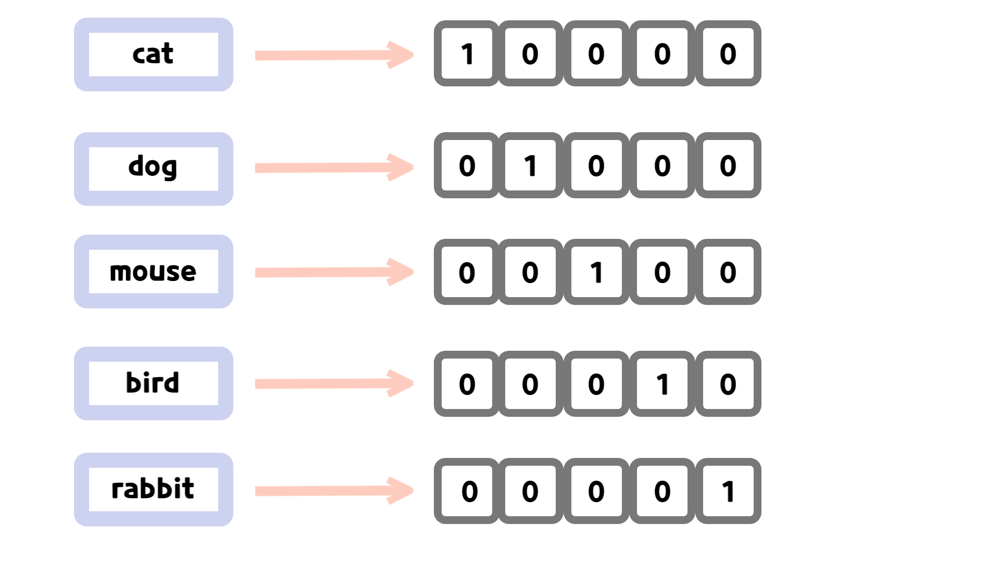
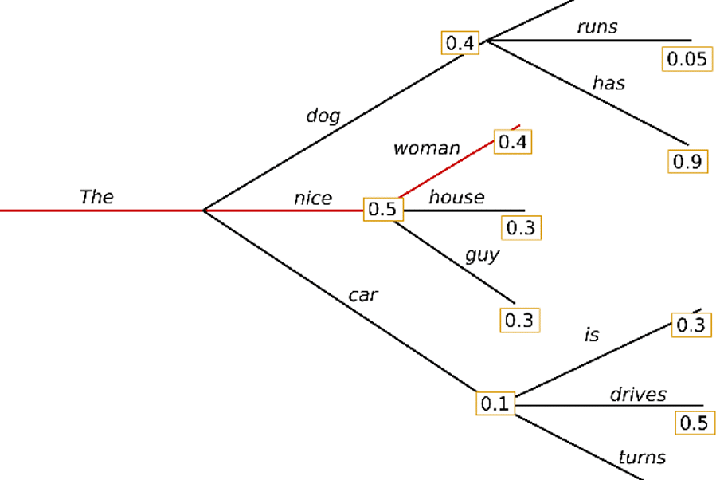
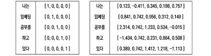
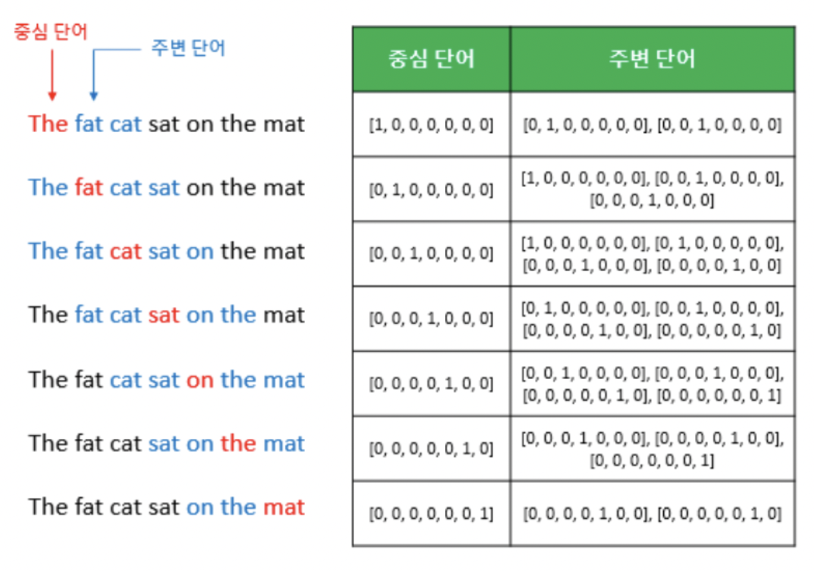
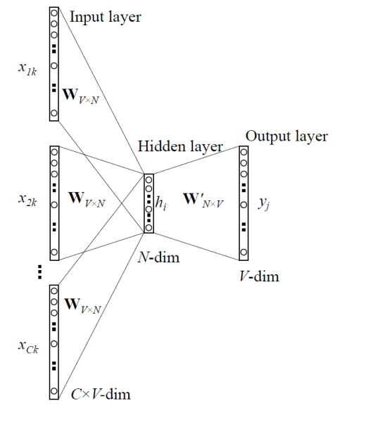
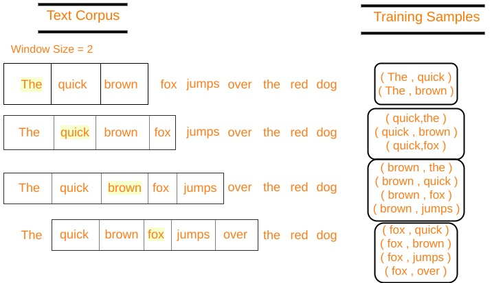
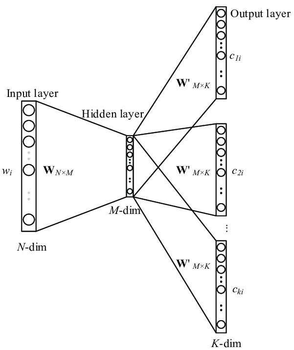
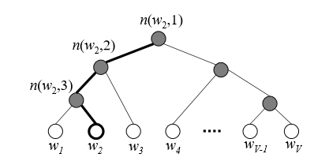

# 임베딩
* 입력된 문장을 토큰으로 나누는 토큰화 작업 후 컴퓨터가 이해할 수 있게 숫자로 변환하는 **텍스트 벡터화**(Text Vectorization) 과정이 필요하다.

* 기초적인 텍스트 벡터화로는 **원-핫 인코딩**(One-Hot Encoding), **빈도 벡터화**(Count Vectorization) 등이 있다.
    1. 원-핫 인코딩: 문서에 등장하는 각 단어를 고유한 색인 값으로 매핑한 후, 해당 색인 위치를 1로 표시하고 나머지는 0으로 표시하는 방식이다.
    <p align="center"></p>

    2. 빈도 벡터화: 문서에서 단어의 빈도수를 세어 해당 단어의 빈도를 벡터로 표현하는 방식이다. 예를 들어 apples라는 단어가 총 4번 등장한다면, 해당 단어에 대한 벡터값은 4가 된다.

* 위 방법을 사용한다면 단어나 문장을 벡터 형태로 변환하기 쉽지만, 벡터의 **희소성**(Sparsity)이 크다는 단점이 있다. 또한, 텍스트의 벡터가 입력 텍스트의 의미를 내포하지 있지 않으므로 두 문장이 의미적으로 유사하다고 해도 벡터가 유사하게 나타나지 않을 수 있다.

* 이와 같은 문제를 해결하기 위해 워드 투 벡터(Word2Vec)나 페스트 텍스트(fastText) 등과 같이 단어의 의미를 학습해 표현하는 **워드 임베딩**(Word Embedding) 기법을 사용한다.

* 워드 임베딩 기법은 단어를 고정된 길이의 실수 벡터로 표현하는 방법으로, 단어의 의미를 벡터 공간에서 다른 단어와의 상대적 위치로 표현해 단어 간의 관계를 추론한다.

## 언어 모델(Language Model)
* 언어 모델이란 입력된 문장으로 각 문장을 생성할 수 있는 확률을 계산하는 모델을 의미한다. 이를 위해 주어진 문장을 바탕으로 문맥을 이해하고, 문장 구성에 대한 예측을 수행한다.
    <p align="center"></p>

### 자기회귀 언어 모델(Autoregressive Language Model)
* 입력된 문장들의 조건부 확률을 이용해 다음에 올 단어를 예측한다. 즉, 언어 모델에서 조건부 확률은 이전 단어들의 시퀀스가 주어졌을 때, 다음 단어의 확률을 계산하는 것을 의미한다.
$$P(w_t|w_1,w_2,...,w_{t-1}) = \frac{P(w_1,w_2,...,w_t)}{P(w_1,w_2,...,w_{t-1})}$$

* **조건부 확률의 연쇄법칙**(Chain rule for conditional probability)을 적용하면 다음과 같다.
$$P(w_t|w_1,w_2,...,w_{t-1})=P(w_1)P(w_2|w_1)P...P(w_t|w_1,w_2,...,w_{t-1})$$

* 문장 전체의 확률은 첫 번째 단어의 확률 P(w_1)과 각 단어가 이전 단어들의 조건부 확률에 따라 발생할 확률의 곱으로 나타낼 수 있다.

* 모델의 출력값이 모델의 입력값으로 다시 사용되는 특징 때문에 자기회귀라는 이름이 붙었다.


### 통계적 언어 모델(Statistic Language Model)
* 언어의 통계적 구조를 이용해 문장이나 단어의 시퀀스를 생성하거나 분석한다. 시퀀스에 대한 확률 분포를 추정해 문장의 문맥을 파악해 다음에 등장할 단어의 확률을 예측한다.

* 일반적으로 **마르코프 체인**(Markov Chain)을 이용해 구현한다. 마르코프 체인은 빈도 기반의 조건부 확률 모델 중 하나로 이전 상태와 현재 상태 간의 전이 확률을 이용해 다음 상태를 예측한다.

* 예로 말뭉치에서 '안녕하세요'라는 문장이 1,000번 등장하고 이어서 '안녕하세요 만나서'가 700번, '안녕하세요 반갑습니다'가 100번 등장했다고 가정해 보자.
$$P(만나서|안녕하세요) = \frac{P(안녕하세요\ 만나서)}{P(안녕하세요)} = \frac{700}{1000}$$
$$P(반갑습니다|안녕하세요) = \frac{P(안녕하세요\ 반갑습니다)}{P(안녕하세요)} = \frac{100}{1000}$$

* 통계적 언어의 모델을 사용할 경우 한 번도 등장한 적이 없는 단어나 문장에 대해서는 정확한 확률을 예측할 수 없다. 이를 **데이터 희소성**(Data sparsity) 문제라고 한다.


## N-gram
* 가장 기초적인 통계적 언어 모델로 텍스트에서 N개의 연속된 단어 시퀀스를 하나의 단위로 취급하여 특정 단어 시퀀스가 등장할 확률을 추정한다.

* N이 1일 때는 **유니그램**(Unigram), 2일 때는 **바이그램**(Bigram)
, 3일 때는 **트라이 그램**(Trigram) 4 이상이면 N-gram이라고 부른다.

* N-gram 언어 모델은 모든 토큰을 사용하지 않고 N-1개의 토큰만을 고려해 확률을 계산한다.
$$P(w_t|w_{t-1},w_{t-2},...w_{t-N+1})$$

```
import nltk

def ngrams(sentence, n):
  words = sentence.split()
  ngrams = zip(*[words[i:] for i in range(n)])
  return list(ngrams)

sentence = "안녕하세요 만나서 진심으로 반가워요"

unigram = ngrams(sentence, 1)
bigram = ngrams(sentence, 2)
trigram = ngrams(sentence, 3)

print(unigram)
print(bigram)
print(trigram)

unigrma = nltk.ngrams(sentence.split(), 1)
bigrma = nltk.ngrams(sentence.split(), 2)
trigrma = nltk.ngrams(sentence.split(), 3)

print(list(unigram))
print(list(bigram))
print(list(trigram))


# 출력값
[('안녕하세요',), ('만나서',), ('진심으로',), ('반가워요',)]
[('안녕하세요', '만나서'), ('만나서', '진심으로'), ('진심으로', '반가워요')]
[('안녕하세요', '만나서', '진심으로'), ('만나서', '진심으로', '반가워요')]
[('안녕하세요',), ('만나서',), ('진심으로',), ('반가워요',)]
[('안녕하세요', '만나서'), ('만나서', '진심으로'), ('진심으로', '반가워요')]
[('안녕하세요', '만나서', '진심으로'), ('만나서', '진심으로', '반가워요')]
```

## TF-IDF(Term Frequency-Inverse Document Frequency)
* 텍스트 문서에서 특정 단어의 중요도를 계산하는 방법으로, 문서 내에서 단어의 중요도를 평가하는 데 사용되는 통계적 가중치를 의미한다. 즉, TF-IDF는 BoW(Bag-of-Words)에 가중치를 부여하는 방법이다.

* BoW는 문서나 문장을 단어의 집합으로 표현하는 방법으로, 문서나 문장에 등장하는 단어의 중복을 허용해 빈도를 기록한다.

* 예로 ['That movie is famous movie', 'I like that actor', 'I don't like that actor'] 말뭉치를 BoW 벡터화하면 아래와 같다.

||I|like|this|movie|don't|famous|is|
|------|---|---|---|---|---|---|---|
|This movie is famous movie|0|0|1|2|0|1|1|
|I like this movie|1|1|1|1|0|0|0|
|I don't like this movie|1|1|1|1|1|0|0|

* BoW를 이용해 벡터화하는 경우 모든 단어는 동일한 가중치를 갖는다.

### 단어 빈도(Term Frequency, TF)
* 문서 내에서 단어의 빈도수를 나타내는 값이다. 예를 들어 3개의 문서에서 'movie'라는 단어가 4번 등장한다면 해당 단어의 TF 값은 4가 된다.
$$TF(t,d) = count(t,d)$$


### 문서 빈도(Document Frequency, DF)
* 한 단어가 얼마나 많은 문서에 나타나는지를 의미한다. 예를 들어 3개의 문서에서 'movie'라는 단어가 4번 등장한다면 해당 단어의 DF 값은 3이 된다.
$$DF(t,D) = count(t \in d: d \in D$$

* DF가 높을 수록 그 단어는 일반적으로 널리 사용되며, 중요도가 낮을 수 있다. 반면에 DF 값이 낮을 수록 특정 단어가 적은 수의 문서에만 등장한다는 뜻으로 특정한 문맥에서만 사용되는 단어일 가능성이 있으며, 중요도가 높을 수 있다.


### 역문서 빈도(Inverse Document Frequency, IDF)
* 전체 문서 수를 문서 빈도로 나눈 다음에 로그를 취한 값을 말한다. 문서 빈도가 작을 수록 IDF 값이 커진다.

$$IDF(t,D) = log(\frac{count(D)}{1 + DF(t,D)})$$


### TF-IDF
* 단어 빈도와 역문서 빈도를 곱한 값으로 사용한다.
$$TF - IDF(t,d,D) = TF(t,d)\ X \ IDF(t,d)$$

* 문서 내에 단어가 자주 등장하지만(TF가 큰 값을 가짐), 전체 문서 내에 해당 단어가 적게 등장한다면(IDF가 큰 값을 가짐) TF-IDF 값은 커진다. 그러므로 전체 문서에서 자주 등장할 확률이 높은 관사나 관용어 등의 가중치는 낮아진다.


```
from sklearn.feature_extraction.text import TfidfVectorizer

tfidf_vectorizer = TfidfVectorizer(
    input="content",  # 입력될 데이터의 형태(content는 문자열 데이터 혹은 바이트 형태)
    encoding="utf-8",
    lowercase = True, # 입력받은 데이터를 소문자로 변환할지
    stop_words=None, # 입력받은 단어들은 단어 사전에 추가되지 않음
    ngram_range=(1,1), # (최솟값, 최댓값) 형태
    max_df=1.0, # 전체 문서 중 일정 횟수 이상 등장한 단어는 불용어 처리
    min_df=1, # 전체 문서 중 일정 횟수 미만으로 등장한 단어를 불용어 처리
    vocabulary=None, # 미리 구축한 단어 사전이 있으면 사용
    smooth_idf=True, # IDF 계산 시 분모에 1을 더한다
)

corpus = [
    "That movie is famous movie",
    "I like that actor",
    "I don't like that actor"
]

tfidf_vectorizer = TfidfVectorizer()
tfidf_vectorizer.fit(corpus)
tfidf_matrix = tfidf_vectorizer.transform(corpus)

print(tfidf_matrix.toarray())
print(tfidf_vectorizer.vocabulary_)


# 출력값
[[0.         0.         0.39687454 0.39687454 0.         0.79374908
  0.2344005 ]
 [0.61980538 0.         0.         0.         0.61980538 0.
  0.48133417]
 [0.4804584  0.63174505 0.         0.         0.4804584  0.
  0.37311881]]
{'that': 6, 'movie': 5, 'is': 3, 'famous': 2, 'like': 4, 'actor': 0, 'don': 1}
```


## Word2Vec
* 단어 간의 유사성을 측정하기 위해 **분포 가설**(distribution hypothesis)을 기반으로 했다. 분포 가설이란 같은 문맥에서 함께 자주 나타나는 단어들은 서로 유사한 의미를 가질 가능성이 높다는 가정이다.

* 분포 가설은 단어 간의 **동시 발생**(co-occurence) 확률 분포를 이용해 단어 간의 유사성을 측정한다.

* 예로 '내일 자동차를 타고 부산에 간다'와 '내일 비행기를 타고 부산에 간다'라는 두 문장에서 '자동차'와 '비행기'는 주변에 분포한 단어들이 동일하거나 유사하므로 비슷한 의미를 가질 것이라고 예상한다.

* 위와 같은 가정을 통해 단어의 **분산 표현**(Distributed Representation)을 학습할 수 있다. 분산 표현이란 단어를 고차원 벡터 공간에 매핑하여 단어의 의미를 담는 것을 의미한다.

* 즉, 유사한 문맥에서 등장하는 단어는 비슷한 벡터 공간상 위치를 갖게 된다. 즉, '자동차'와 '비행기'라는 단어는 벡터 공간에서 서로 가까운 위치에 표현된다.


### 단어 벡터화
* 크게 **희소 표현**(sparse representation)과 **밀집 표현**(dense representation)으로 나눌 수 있다. 원-핫 인코딩, TF-IDF 등의 빈도 기반 방법은 희소 표현이며, Word2Vec은 밀집 표현이다.
    <p align="center"></p>

* 밀집 표현은 단어를 고정된 크기의 실수 벡터로 표현하기 때문에 단어 사전의 크기가 커지더라도 벡터의 크기가 커지지 않는다.

* 밀집 표현 벡터화는 학습을 통해 단어를 벡터화하기 때문에 단어의 의미를 비교할 수 있다. 밀집 표현된 벡터를 **단어 임베딩 벡터**(Word Embedding Vector)라고 하며, Word2Vec은 대표적인 단어 임베딩 벡터이다.

* Word2Vec은 밀집 표현을 위해 CBoW와 Skip-gram이라는 두 가지 방법을 사용한다.

  ### CBoW(Continuous Bag of Words)
  * 주변에 있는 단어를 가지고 중간에 있는 단어를 예측하는 방법이다.

  * 예측해야 할 단어를 **중심 단어**(Center Word)라고 하고, 예측에 사용되는 단어들을 **주변 단어**(Context Word)라고 한다. 중심 단어를 예측하기 위해 몇 개의 주변 단어를 고려할지 정해야 하는데, 이 범위를 **윈도**(Window)라고 한다.

  * 학습을 위해 윈도를 이동해 가며 학습하는데, 이러한 방법은 **슬라이딩 윈도**(Sliding Window)라 한다. CBoW는 슬라이딩 윈도를 사용해 한 번의 학습으로 여러 개의 중심 단어와 그에 대한 주변 단어를 학습할 수 있다.
  <p align="center"></p>

  * CBoW 모델은 각 입력 단어의 원-핫 벡터를 입력값으로 받는다. 입력 문장 내 모든 단어의 임베딩 벡터를 평균 내어 중심 단어의 임베딩 벡터를 예측한다.

  * 입력 단어는 원-핫 벡터로 표현돼 **투사층**(Projection Layer, Hidden Layer)에 입력된다. 투사층이란 원-핫 벡터의 인덱스에 해당하는 해당하는 임베딩 벡터를 반환하는 **순람표**(Lookup table, LUT) 구조가 된다.

  * 투사층을 통과하면 각 던어는 N 크기의 임베딩 벡터로 변환된다. 임베딩 된 각 단어의 벡터의 평균값을 계산한 후 가중치 행렬 W'_{NXV}와 곱하면 V 크기의 벡터를 얻는다. 이 벡터에 소프트맥스 함수를 이용해 중심 단어를 예측한다.
  <p align="center"></p>

  ### Skip-gram
  * CBoW와 반대로 중심 단어를 입력으로 받아서 주변 단어를 예측하는 모델이다. 중심 단어를 기준으로 양쪽으로 window 크기만큼의 단어들을 주변 단어로 삼아 훈련 데이터세트를 만든다.

  * CBoW는 하나의 window에서 하나의 학습 데이터가 만들어지는 반면, Skip-gram은 중심 단어와 주변 단어를 하나의 쌍으로 하여 여러 학습 데이터가 만들어진다. 따라서 더 많은 학습 데이터세트를 추출할 수 있으며, 일반적으로 CBoW보다 더 뛰어난 성능을 보인다.
  <p align="center"></p>

  * 입력 단어의 원-핫 벡터를 투사층에 입력하여 해당 단어의 임베딩 벡터를 가져온다. 입력 단어의 임베딩과 W'_{MXK} 가중치와의 곱셈을 통해 K 크기의 벡터를 얻고, 이 벡터에 소프트맥스 연산을 취함으로써 주변 단어를 예측한다.
  <p align="center"></p>

  * 소프트맥스 연산은 모든 단어를 대상으로 내적 연산을 수행하는데 단어 사전의 크기가 커지면 학습 속도가 느려질 수 있다. 이를 해결하기 위한 계층적 소프트맥스와 네거티브 샘플링 기법이 있다.

  ```
  # 학습할 단어의 수를 V, 임베딩 차원을 E로 설정해 W_{VXE} 행렬과 W'_{EXV}
  # 행렬을 최적화하며 학습한다.

  # W_{VXE} 행렬은 룩업 연산을 수행하는데, 룩업 연산이랑 이산 변수의 값을 연속적인 벡터로 변환하는 과정이다. Embedding 클래스를 통해 룩업 연산을 쉽게 할 수 있다.
  
  embedding = torch.nn.Embedding(
    num_embeddings, # 이산 변수의 개수로 단어 사전의 크기를 의미
    embedding_dim, # 임베딩 벡터의 크기를 의미
    padding_idx=None, # 해당 인덱스의 임베딩 벡터를 0으로 설정한다.
    max_norm-None, # 임베딩 벡터의 최대 크기를 지정한다.
    norm_type=2.0, # 임베딩 벡터의 크기를 제한하는 방법을 선택한다.
  )
  ```
  ```
  # 기본 Skip-gram 클래스
  from torch import nn

  class VanillaSkipgram(nn.Module):
    def __init__(self, vocab_size, embedding_dim):
      super().__init__()
      self.embedding = nn.Embedding(
          num_embeddings=vocab_size,
          embedding_dim=embedding_dim
      )
      self.linear = nn.Linear(
          in_features=embedding_dim,
          out_features=vocab_size,
      )

    def forward(self, input_ids):
      embeddings = self.embedding(input_ids)
      output = self.linear(embeddings)
      return output
  ```
  ```
  # 영화 리뷰 데이터세트 전처리
  import pandas as pd
  from Korpora import Korpora
  from konlpy.tag import Okt

  corpus = Korpora.load("nsmc")
  corpus = pd.DataFrame(corpus.test)

  tokenizer = Okt()
  tokens = [tokenizer.morphs(review) for review in corpus.text]
  print(tokens[:3])


  # 출력값
  [['굳', 'ㅋ'], ['GDNTOPCLASSINTHECLUB'], ['뭐', '야', '이', '평점', '들', '은', '....', '나쁘진', '않지만', '10', '점', '짜', '리', '는', '더', '더욱', '아니잖아']]
  ```
  ```
  # 단어 사전 구축
  from collections import Counter

  def build_vocab(corpus, n_vocab, special_tokens):
    counter = Counter()
    for tokens in corpus:
      counter.update(tokens)
    vocab = special_tokens
    for token, count in counter.most_common(n_vocab):
      vocab.append(token)
    return vocab

  vocab = build_vocab(corpus=tokens, n_vocab=5000, special_tokens=["<unk>"])
  token_to_id = {token: idx for idx, token in enumerate(vocab)}
  id_to_token = {idx: token for idx, token in enumerate(vocab)}

  print(vocab[:10])
  print(len(vocab))


  # 출력값
  ['<unk>', '.', '이', '영화', '의', '..', '가', '에', '...', '을']
  5001
  ```
  ```
  # Skip-gram의 단어 쌍 추출
  def get_word_pairs(tokens, window_size):
  pairs = []
  for sentence in tokens:
    sentence_length = len(sentence)
    for idx, center_word in enumerate(sentence):
      window_start = max(0, idx - window_size)
      window_end = min(sentence_length, idx + window_size + 1)
      center_word = sentence[idx]
      context_words = sentence[window_start:idx] + sentence[idx+1:window_end]
      for context_word in context_words:
        pairs.append([center_word, context_word])
  return pairs

  word_pairs = get_word_pairs(tokens, window_size=2)
  print(word_pairs[:5])

  
  # 출력값
  [['굳', 'ㅋ'], ['ㅋ', '굳'], ['뭐', '야'], ['뭐', '이'], ['야', '뭐']]
  ```
  ```
  # 인덱스 쌍 변환
  def get_index_pair(word_pairs, token_to_id):
  pairs = []
  unk_index = token_to_id["<unk>"]
  for word_pair in word_pairs:
    center_word, context_word = word_pair
    center_index = token_to_id.get(center_word, unk_index)
    context_index = token_to_id.get(context_word, unk_index)
    pairs.append([center_index, context_index])
  return pairs

  index_pairs = get_index_pair(word_pairs, token_to_id)
  print(index_pairs[:5])


  # 출력값
  [[595, 100], [100, 595], [77, 176], [77, 2], [176, 77]]
  ```
  ```
  # 데이터로더 적용
  import torch
  from torch.utils.data import TensorDataset, DataLoader

  index_pairs = torch.tensor(index_pairs)
  center_indexs = index_pairs[:, 0]
  contenxt_indexs = index_pairs[:, 1]

  dataset = TensorDataset(center_indexs, contenxt_indexs)
  dataloader = DataLoader(dataset, batch_size=32, shuffle=True)
  ```
  ```
  # Skip-gram 모델 준비 작업
  from torch import optim

  device = "cuda" if torch.cuda.is_available() else "cpu"
  word2vec = VanillaSkipgram(vocab_size=len(token_to_id), embedding_dim=128).to(device)
  criterion = nn.CrossEntropyLoss().to(device)
  optimizer = optim.SGD(word2vec.parameters(), lr=0.1)
  ```
  ```
  # 모델 학습
  for epoch in range(10):
    cost = 0.0
    for input_ids, target_ids in dataloader:
      input_ids = input_ids.to(device)
      target_ids = target_ids.to(device)

      logits = word2vec(input_ids)
      loss = criterion(logits, target_ids)

      optimizer.zero_grad()
      loss.backward()
      optimizer.step()

      cost += loss

    cost = cost / len(dataloader)
    print(f"Epoch : {epoch+1:4d}, Cost : {cost:.3f}")

  
  # 출력값
  Epoch :    1, Cost : 6.197
  Epoch :    2, Cost : 5.982
  Epoch :    3, Cost : 5.932
  Epoch :    4, Cost : 5.902
  Epoch :    5, Cost : 5.880
  Epoch :    6, Cost : 5.862
  Epoch :    7, Cost : 5.847
  Epoch :    8, Cost : 5.834
  Epoch :    9, Cost : 5.823
  Epoch :   10, Cost : 5.812
  ```
  ```
  # 임베딩 값 추출(W_{VXE} 행렬 이용)
  token_to_embedding = dict()
  embedding_matrix = word2vec.embedding.weight.detach().cpu().numpy()

  for word, embedding in zip(vocab, embedding_matrix):
    token_to_embedding[word] = embedding

  index = 30
  token = vocab[30]
  token_embedding = token_to_embedding[token]
  print(token)
  print(token_embedding)


  # 출력값
  연기
  [ 0.29166934  1.6510893  -0.64923924 -0.9572023   0.46776375,  ..................,  0.93559116  1.0985746   0.5831354   1.9771556   0.2871302   0.77766114
  -0.33818266  1.8306098 ]
  ```
  ```
  # 코사인 유사도를 이용한 단어 임베딩 유사도 계산
  import numpy as np
  from numpy.linalg import norm

  def cosine_similarity(a, b):
    cosine = np.dot(b, a) / (norm(b, axis=1) * norm(a))
    return cosine

  def top_n_index(cosine_matrix, n):
    closet_indexes = cosine_matrix.argsort()[::-1]
    top_n = closet_indexes[1 : n+1]
    return top_n

  cosine_matrix = cosine_similarity(token_embedding, embedding_matrix)
  top_n = top_n_index(cosine_matrix, n=5)

  print(f"{token}와 가장 유사한 단어 5개")

  for index in top_n:
    print(f"{id_to_token[index]} - 유사도 : {cosine_matrix[index]:.4f}")


  # 출력값
  연기와 가장 유사한 단어 5개
  귀여워 - 유사도 : 0.3091
  등장인물 - 유사도 : 0.3049
  행 - 유사도 : 0.2923
  하냐 - 유사도 : 0.2908
  12년 - 유사도 : 0.2822
  ```


### 계층적 소프트맥스(Hierachical Softmax)
* 출력층을 **이진 트리**(Binary tree) 구조로 표현해 연산을 수행한다. 이때 자주 등장하는 단어일수록 트리의 상단 노드에 위치하고, 드물게 등장하는 단어일수록 하위 노드에 배취된다.

* 각 노드는 학습이 가능한 벡터를 가지며, 입력값은 해당 노드의 벡터와 내적값을 계산한 후 시그모이드 함수를 통해 확률을 계산한다.

* **잎 노드**(Leaf Node)는 가장 깊은 노드로, 각 단어를 의미하며, 모델은 각 노드의 벡터를 최적화하여 단어를 잘 예측하 수 있게 한다.
  <p align="center"></p>


### 네거티브 샘플링(Negative Sampling)
* 전체 단어 집합에서 일부 단어를 샘플링하여 오답 단어로 사용한다.

* 학습 윈도 내에 등장하지 않는 단어 n개를 추출하여 정답 단어와 함께 소프트맥스 연산을 수행한다.

* n은 보통 5~20개를 사용하며, 각 단어가 추출될 확률은 다음과 같다.
  * 말뭉치 내에 단어 '추천해요'가 100번 등장했고, 전체 단어의 빈도가 2,000이라면 f(추천해요) = 100/2000 = 0.05가 된다.
$$P(w_i) = \frac{f(w_i)^{0.75}}{\sum_{j=0}^{v}f(w_i)^{0.75}}$$

* 실제 데이터에서 추출된 단어 쌍은 1로, 네거티브 샘플링을 통해 추출된 가짜 단어 쌍은 0으로 labeling한다. 즉, 다중 분류에서 이진 분류로 학습 목적이 바뀌게 된다.
<p align="center"></p>

* 네거티브 샘플링 모델에서는 입력 단어의 임베딩과 해당 단어가 맞는지 여부를 나타내는 레이블(1 또는 0)을 가져와 내적 연산을 수행한다. 내적 연산을 통해 얻은 값은 시그모이드 함수를 통해 확률값으로 변환된다. 이때 레이블리 1인 경우 해당 확률값이 높아지도록, 레이블이 0인 경우 해당 확률값이 낮아지도록 모델의 가중치가 최적화된다.

```
# gensim 라이브러리를 이용한 네거티브 샘플링
# gensim 라이브러리에 있는 Word2Vec class

word2vec = gensim.models.Word2Vec(
    sentence=None,  # 모델의 학습 데이터
    corpus_file=None, # 학습 데이터를 파일로 나타날 때 파일 경로
    vector_size=100, # 학습할 임베딩 벡터의 크기
    alpha=0.025, # Word2Vec 모델의 학습률
    window=5, # 학습 데이터를 생성할 window의 크기
    min_count=5, # 학습에 사용할 단어의 최소 빈도, 말뭉치 내에 최소 빈도만큼 등장하지 않은 단어는 학습에서 제외
    workers=3, # 병렬 학습할 스레드의 수
    sg=0, # Skip-gram 모델의 사용 여부, 1이면 Skip-gram 0이면 CBoW
    hs=0,# 계층적 소프트맥스 사용 여부, 1이면 사용 0이면 사용 X
    cbow_mean=1, # 1이면 평균화 사용, 0이면 평균화하지 않고 합산한다
    negative=5, # 네거티브 샘플링의 단어 수. 0이면 네거티브 샘플링 사용 X
    ns_exponent=0.75, # 네거티브 샘플링 확률의 지수
    max_final_vocab=None, # 단어 사전의 최대 크기
    epochs=5,
    batch_words=10000 # 몇 개의 단어로 학습 배치를 구성할지 결정
)
```
```
# Word2Vec 모델 학습
from gensim.models import Word2Vec

word2vec = Word2Vec(
    sentences=tokens,
    vector_size=128,
    window=5,
    min_count=1,
    sg=1,
    epochs=3,
    max_final_vocab=10000
)

# word2vec.save("../models/word2vec.model")
# word2vec = Word2Vec.load("../models/word2vec.model")
```
```
# 임베딩 추출 및 유사도 계산
word = "연기"
print(word2vec.wv[word])
print(word2vec.wv.most_similar(word, topn=5))
print(word2vec.wv.similarity(w1=word, w2="연기력"))
```

* 한국어는 어근과 접사, 조사 등으로 이루어진 규칙을 가지고 있기 때문에 Word2Vec 모델에서는 이러한 구조적 특징을 제대로 학습하기가 어렵다.


## fastText
* 단어와 문장을 벡터로 변환하는 기술을 기반으로 한다. fastText는 단어의 하위 단어를 고려하므로 더 높은 정확도와 성능을 제공한다. 하위 단어를 고려하기 위해 **N-gram**을 사용해 단어를 분해하고 벡터화하는 방법으로 동작한다.

* fastText에서는 단어의 벡터화를 위해 <. >와 같은 특수 기호를 사용하여 단어의 시작과 끝을 나타낸다.

* 기호가 추가된 단어는 N-gram을 사용하여 **하위 단어 집합**(Subword Set)으로 분해된다. 예로 '서울특별시'를 바이그램으로 분해하면 '<서', '서울', '울특', '특별', '별시', '시>'가 된다. 각 하위 단어는 고유한 벡터값을 가지며, 이를 모두 합산하여 입력 단어의 최종 임베딩 벡터를 계산한다.

* 같은 하위 단어를 공유하는 단어끼리는 정보를 공유해 학습할 수 있다. 이를 통해 비슷한 단어끼리는 비슷한 임베딩 벡터를 갖게 되어, 단어 간 유사도를 높일 수 있다.

* 하위 단어 기반의 임베딩 방법을 사용하면, 말뭉치에 등장하지 않은 단어(OOV 단어)라도 유사한 하위 단어를 가지고 있으면 유사한 임베딩 벡터를 갖게 된다.

* fastText 모델도 CBoW와 Skip-gram으로 구성되며 네거티브 샘플링 기법을 사용해 학습한다.
```
# fastText 클래스

fasttext = gensim.models.FastText(
    sentence=None,  # 모델의 학습 데이터
    corpus_file=None, # 학습 데이터를 파일로 나타날 때 파일 경로
    vector_size=100, # 학습할 임베딩 벡터의 크기
    alpha=0.025, # Word2Vec 모델의 학습률
    window=5, # 학습 데이터를 생성할 window의 크기
    min_count=5, # 학습에 사용할 단어의 최소 빈도, 말뭉치 내에 최소 빈도만큼 등장하지 않은 단어는 학습에서 제외
    workers=3, # 병렬 학습할 스레드의 수
    sg=0, # Skip-gram 모델의 사용 여부, 1이면 Skip-gram, 0이면 CBoW
    hs=0,# 계층적 소프트맥스 사용 여부, 1이면 사용 0이면 사용 X
    cbow_mean=1, # 1이면 평균화 사용, 0이면 평균화하지 않고 합산한다
    negative=5, # 네거티브 샘플링의 단어 수. 0이면 네거티브 샘플링 사용 X
    ns_exponent=0.75, # 네거티브 샘플링 확률의 지수
    max_final_vocab=None, # 단어 사전의 최대 크기
    epochs=5,
    batch_words=10000 # 몇 개의 단어로 학습 배치를 구성할지 결정
    min_n=3, # 사용할 N-gram의 최솟값
    max_n=6 $ N-gram의 최댓값
)
```
```
# KorNLI 데이터세트 전처리
from Korpora import Korpora

corpus = Korpora.load("kornli")
corpus_texts = corpus.get_all_texts() + corpus.get_all_pairs()
tokens = [sentence.split() for sentence in corpus_texts]

print(tokens[:3])


# 출력값
[['개념적으로', '크림', '스키밍은', '제품과', '지리라는', '두', '가지', '기본', '차원을', '가지고', '있다.'], ['시즌', '중에', '알고', '있는', '거', '알아?', '네', '레벨에서', '다음', '레벨로', '잃어버리는', '거야', '브레이브스가', '모팀을', '떠올리기로', '결정하면', '브레이브스가', '트리플', 'A에서', '한', '남자를', '떠올리기로', '결정하면', '더블', 'A가', '그를', '대신하러', '올라가고', 'A', '한', '명이', '그를', '대신하러', '올라간다.'], ['우리', '번호', '중', '하나가', '당신의', '지시를', '세밀하게', '수행할', '것이다.']]
```

* Word2Vec 모델과 다르게, fastText 모델은 입력 단어의 구조적 특징을 학습할 수 있기 때문에 형태소 분석기를 통해 토큰화하지 않고 띄어쓰기를 기준으로 단어를 토큰화해 학습을 진행한다.

```
# fastText 모델 실습
from gensim.models import fasttext

fastText = FastText(
    sentence=tokens,
    vector_size=128,
    window=5,
    min_count=5,
    sg=1,
    epochs=3,
    min_n=2,
    max_n=6
)

# fastText.save("../models/fastText.model")
# fastText = FastText.load("../models/fastText.model")
```

```
# fastText OOV 처리

oov_token = "사랑해요"
oov_vector = fastText.wv[oov_token]

print(oov_token in fastText.wv.index_to_key)
print(fastText.wv.most_similar(oov_vector, topn=5))
```