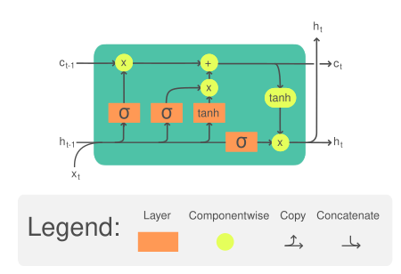

# 순환 신경망(Recurrent Neural Network, RNN)
* RNN 모델은  순서가 있는 **연속적인 데이터**(Sequence data)를 처리하는 데 적합한 구조를 갖고 있다. RNN은 각 **시점**(Time step)의 데이터가 이전 시점의 데이터와 독립적이지 않다는 특성 때문에 효과적으로 작동한다.

* 자연어는 한 단어가 이전의 단어들과 상호작용하여 문맥을 이루고 의미를 형성하기 때문에 자연어 데이터도 일종의 연속형 데이터로 볼 수 있다.

    ex) 금요일이 지나면... => 다음으로 올 단어는 주말 or 토요일

    ex) 수요일이 지나면 목요일, 목요일이 지나면 금요일, 금요일이 지나면... => 다음으로 올 단어는 토요일
    
* 긴 문장일수록 앞선 단어들과 뒤따르는 단어들 사이에 강한 **상관관계**(Correlation)를 가진다.

### 순환 신경망
* 연속형 데이터를 순서대로 입력받아 처리하며 각 시점마다 **은닉 상태**(Hidden state)의 형태로 저장한다.

* 각 시점의 데이터를 입력으로 받아 은닉 상태와 출력값을 계산하는 노드를 순환 신경망의 **셀**(Cell)이라 한다. 셀은 이전 시점의 은닉 상태 h_{t-1}을 입력으로 받아 현재 시점의 은닉 상태 h_t를 계산한다.   
    <p align="center"></p>

* 순환 신경망의 은닉 상태(h_t) 계산 방법
     * sigma_h는 순환 신경망의 은닉 상태를 계산하기 위한 활성화 함수이다. 은닉 상태의 활성화 함수는 이전 시점 t-1의 은닉 상태 h_{t-1}과 입력값 x_t를 입력받아 현재 시점의 은닉 상태 h_t를 계산한다.

     * 이때, sigma_h는 가중치(W)와 편향(b)을 이용해 계산한다. W_{hh}는 이전 시점의 은닉 상태 h_{t-1}에 대한 가중치, W_{xh}는 입력값 x_t에 대한 가중치, b_h는 은닉 상태 h_t의 편향을 의미한다.
$$h_t = \sigma_h(h_{t-1}, x_t)$$
$$h_t = \sigma_h(W_{hh}h_{t-1} + W_{xh}x_t + b_h)$$


* 순환 신경망 출력값(y_t) 계산 방법
     * sigma_y는 순환 신경망의 출력값을 계산하기 위한 활성화 함수이다. 출력값 활성화 함수는 현재 시점의 은닉 상태 h_t를 입력으로 받아 출력값 y_t를 계산한다.

     * W_{hy}는 현재 시점의 은닉 상태 h_t에 대한 가중치, b_y는 출력값 y_t의 편향을 의미한다.
$$y_t = \sigma_y(h_t)$$
$$y_t = \sigma_y(W_{hy}h_t + b_y)$$


1. **일대다 구조(One-to-Many)**
    * 하나의 입력 시퀀스에 대해 여러 개의 출력값을 생성하는 순환 신경망 구조

        ex) 문장을 입력으로 받고, 문장에서 각 단어의 품사를 예측, 이미지를 입력으로 받고 이미지에 대한 설명 출력(이미지 캡셔닝 모델, Image Captioning)

    * 일대다 구조를 구현하기 위해서는 출력의 길이를 미리 알고 있어야 한다. 이를 위해 입력 시퀀스를 처리하면서 시퀀스의 정보를 활용해 출력 시퀀스의 길이를 예측하는 모델을 함께 구현해야 한다.


2. **다대일 구조(Many-to-One)**
    * 여러 개의 입력 시퀀스에 대해 하나의 출력값을 생성하는 순환 신경망 구조

        ex) **감성 분류(Sentiment Analysis)** 분야에서 입력 시퀀스는 문장으로 이루어져 있으며, 출력값은 해당 문장의 감정(긍정, 부정)으로 이루어져 있다.


3. **다대일 구조(Many-to-Many)**
    * 입력 시퀀스와 출력 시퀀스가 여러 개인 경우에 사용되는 순환 신경망 구조
        
        ex) 입력 문장에 대해 번역된 출력 문장을 생성하는 번역기, 음성 인식 시스템에서 음성 신호를 입력으로 받아 문장을 출력하는 음성 인식기

    * 입력 시퀀스와 출력 시퀀스의 길이가 다른 경우 길이를 맞추기 위해 패딩을 추가하거나 잘라내는 등의 전처리 과정이 수행된다.

    * 다대다 구조는 **시퀀스-시퀀스(Seq2Seq)** 구조로 이루어져 있다. 시퀀스-시퀀스 구조는 입력 시퀀스를 처리하는 **인코더**(Encoder)와 출력 시퀀스를 처리하는 **디코더**(Decoder)로 구성된다.


4. 양방향 순환 신경망(Bidirectional Recurrent Neural Network, BiRNN)
    * 순환 신경망은 현재 시점의 입력값을 처리하기 위해 이전 시점(t-1)의 은닉 상태를 이용하는데, 양방향 순환 신경망에서는 이전 시점(t-1)의 은닉 상태뿐만 아니라 이후 시점(t+1)의 은닉 상태도 함께 이용한다.

        ex) "인생은 B와 _ 사이의 C이다."라는 문장은 앞의 문장만이 아니라 뒤의 문장에도 영향을 받는다.

    * 이러한 방법은 입력 데이터를 순방향으로 처리하는 것만 아니라 역방향으로 거꾸로 읽어 들여 처리하는 방식으로 이루어진다.


5. 다중 순환 신경망(Stacked Recurrent Neural Network)
    * 여러 개의 순환 신경망을 연결하여 구성한 모델로 각 순환 신경망이 서로 다른 정보를 처리하도록 설계돼 있다.

    * 다중 순환 신경망은 여러 개의 순환 신경망 층으로 구성되며, 각 층에서의 출력값은 다음 층으로 전달되어 처리된다.


```
# 순환 신경망 클래스

rnn = torch.nn.RNN(
    input_size, # 입력 특성 크기
    hidden_size,    # 은닉 상태 크기
    num_layers=1,   # 순환 신경망의 층수, 2 이상이면 다중 순환 신경망
    nonlinearity="tanh",    # 순환 신경망에서 사용되는 활성화 함수 \sigma의 종류를 설정
    bias=False, # 편향 값 사용 유무 설정
    batch_first=True,   # 입력 배치 크기를 첫 번째 차원으로 사용할지, 참이면 [배치 크기, 시퀀스 길이, 
                        # 입력 특성 크기], 거짓이면 [시퀀스 길이, 배치 크기, 입력 특성 크기]
    dropout=0,  # 과대적합 방지를 위한 dropout 확률 설정
    bidirectional=False # 순환 신경망 구조가 양방향으로 처리할지 여부를 설정
)
```

* h_0는 초기 은닉 상태로 순방향 계층 수와 양방향 구조에 따라 전달해야 하는 크기가 달라진다. [ 계층 수 X (양방향 여부 + 1), 배치 크기, 은닉 상태 크기]

* 순방향 연산 결과는 출력값과 최종 은닉 상태과 반환된다. 출력값은 [ 배치 크기, 시퀀스 길이, (양방향 여부 + 1) X 은닉 상태 크기], 최종 은닉 상태는 초기 은닉 상태와 동일한 차원으로 반환된다.
```
# 순환 신경망 클래스를 이용한 양방향 다층 신경망 구성하기
import torch
from torch import nn

input_size = 128
output_size = 256
num_layers = 3
bidirectional = True

model = nn.RNN(
    input_size=input_size,
    hidden_size=output_size,
    num_layers=num_layers,
    nonlinearity="tanh",
    batch_first=True,
    bidirectional=bidirectional,
)

batch_size=4
sequence_len=6

inputs = torch.randn(batch_size, sequence_len, input_size)
h_0 = torch.rand(num_layers * (int(bidirectional) + 1), batch_size, output_size)

outputs, hidden = model(inputs, h_0)
print(outputs.shape)
print(hidden.shape)


# 출력값
torch.Size([4, 6, 512])
torch.Size([6, 4, 256])
```

### 장단기 메모리(Long Short-Term Memory, LSTM)
* 일반적인 순환 신경망은 특정 시점에서 이전 입력 데이터의 정보를 이용해 출력값을 예측하는 구조이므로 시간적으로 먼 과거의 정보는 잘 기억하지 못한다.

* 또한, 활성화함수로 사용되는 하이퍼블릭 탄젠트 함수나 ReLU 함수의 특성으로 인해 역전파 과정에서 기울기 소실이나 기울기 폭주가 발생할 수 있다.

* 이러한 문제를 해결하기 위해 장단기 메모리를 사용한다. 장단기 메모리는 순환 신경망과 비슷한 구조를 가지지만, **메모리 셀**(Memory cell)과 **게이트**(Gate)라는 구조를 도입해 장기 의존성 문제와 기울기 소실 문제를 해결한다.

* 장단기 메모리는 **셀 상태**(Cell state)와 **망각 게이트**(Forget gate), **기억 게이트**(Input gate), **출력 게이트**(Output gate)로 정보의 흐름을 제어한다.
    * 셀 상태: 정보를 저장하고 유지하는 메모리 역할을 하며 출력 게이트와 입력 게이트에 의해 제어된다.
    $$c_t = f_t\bullet c_{t-1} + g_i\bullet i_i$$
    $$\bullet 은\ 원소별\ 곱셈\ 연산을\ 의미한다.$$
    * 망각 게이트: 이전 셀 상태에서 어떠한 정보를 삭제할지 결정하는 역할을 하며 현재 입력(x_t)과 이전 셀 상태(h_{t-1})를 입력으로 받아 어떤 정보를 삭제할지 결정한다. 출력값이 1에 가까울수록 더 많은 정보를 유지하고 반대로 0애 가까우면 더 많은 정보를 삭제한다.
    $$f_t = \sigma(W_x^{(f)}x_t + W_h^{(f)}h_{t-1} + b^{(f)})$$
    $$W_x^{(f)}과\ W_h^{(f)}은\ 입력값과\ 은닉\ 상태를\ 위한\ 가중치, b^{(f)}는\ 망각\ 게이트의\ 편향을\ 의미$$
    * 기억 게이트: 새로운 정보를 어떤 부분에 추가할지 결정하는 역할을 하며 현재 입력과 이전 셀 상태를 입력으로 받아 어떤 정보를 추가할지 결정한다. 1에 가까울수록 기억할 정보가 많아지고, 0에 가까울수록 정보를 망각하게 된다.
    $$g_i = tanh(W_x^{(g)}x_t + W_x^{(g)}h_{t-1} + b^{(g)})$$
    $$i_i = sigmoid(W_x^{(i)}x_t + W_x^{(i)}h_{t-1} + b^{(i)})$$
    * 출력 게이트: 셀 상태의 정보 중 어떤 부분을 출력할지 결정하는 역할을 하며 현재 입력과 이전 셀 상태, 그리고 새로 추가된 정보를 입력으로 받아 출력할 정보를 결정한다. 현재 시점의 은닉 상태 값(h_t)을 얼마나 사용할지 결정한다.
    $$o_t = \sigma(W_x^{(o)}x_t + W_h^{(o)}h_{t-1} + b^{(o)})$$

    * 은닉 상태 갱신: 현재 시점의 은닉 상태가 이전 시점의 은닉 상태에서 얼마나 영향을 받는지 계산할 수 있다.
    $$h_t = o_t\bullet tanh(c_t)$$

* 망각 게이트, 기억 게이트와 출력 게이트 모두 활성화 함수로 시그모이드 함수를 사용한다. 따라서 게이트의 출력값은 각각 0에서 1 사이의 값으로 결정된다. 이 값이 해당 게이트가 입력값에 대해 얼마나 많은 정보를 통과시킬지 결정한다.


    <p align="center"></p>


```
# 장단기 메모리 클래스
lstm = torch.nn.LSTM(
    input_size,
    hidden_size,
    num_layers=1,
    bias=False,
    batch_first=True,
    dropout=0,
    bidirectional=False,
    proj_size=0 # 투사 크기 매개변수로 장단기 메모리 계층의 출력에 대해 선형 투사 크기를 결정
                # 투사 크기가 0보다 큰 경우, 은닉 상태를 선형 투사를 통해 다른 차원으로 매핑한다.
                # 이 값을 통해 출력 차원을 줄이거나 다른 차원으로 변환할 수 있다.
                # 0이면, 은닉 상태의 차원을 변환하지 않고 그대로 유지한다.
                # 투사 크기는 은닉 상태 크기보다 작은 값으로 설정한다.
)
```

* 초기 은닉 상태의 크기는 투사 크기(proj_size)가 0보다 큰 경우 출력층의 차원을 투사 크기로 입력한다.

* 순방향 연산의 출력값은 선형 투사가 적용된 경우 [ 배치 크기, 시퀀스 길이, (양방향 여부 + 1) X 투사 크기(또는 은닉 상태 크기)]로 구성된다. 최종 은닉 상태는 초기 은닉 상태와 동일한 차원이 반환된다.
```
import torch
from torch import nn

input_size = 128
output_size = 256
num_layers = 3
bidirectional = True
proj_size = 64

model = nn.LSTM(
    input_size=input_size,
    hidden_size=output_size,
    num_layers=num_layers,
    batch_first=True,
    bidirectional=bidirectional,
    proj_size=proj_size,
)

batch_size=4
sequence_len=6

inputs = torch.randn(batch_size, sequence_len, input_size)
h_0 = torch.rand(num_layers * (int(bidirectional) + 1), batch_size, prog_size if prog_size > 0 else output_size)
c_0 = torch.rand(num_layers * (int(bidirectional) + 1), batch_size, output_size)

outputs, (h_n, c_n) = model(inputs, (h_0,c_0))
print(outputs.shape)
print(h_n.shape)
print(c_n.shape)


# 출력값
torch.Size([4, 6, 128])
torch.Size([6, 4, 64])
torch.Size([6, 4, 256])
```