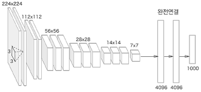

# 합성곱 신경망(Convolutional Neural Network, CNN)
* 합성곱 연산은 이미지의 특정 영역에서 입력값의 분포 또는 변화량을 계산해 출력 노드를 생성한다. 특정 영역 안에서 연산을 수행하므로 **지역 특징**(Local Features)을 효과적으로 추출할 수 있다.

* 이미지 데이터는 고정된 프레임 내에 객체들의 위치와 형태가 자유분방하므로 여러 영역의 지역 특징을 조합해 입력 데이터의 전반적인 **전역 특징**(Global Features)을 파악할 수 있다.


## 합성곱 계층
* 합성곱 계층은 입력 데이터와 필터를 합성곱해 출력 데이터를 생성하는 계층이다.

* 합성곱 계층은 필터를 사용해 데이터의 특징을 추출하므로 데이터의 지역적인 패턴을 인식할 수 있으며, 입력 데이터의 모든 위치에서 동일한 필터를 사용하므로 모델 매개변수를 공유한다.

* 이러한 합성곱 계층을 여러 겹 쌓아 모델을 구성하며, 합성곱 계층이 많아질수록 모델의 복잡도가 증가하므로 더 다양한 특징을 추출해 학습할 수 있다.

### 필터(Filter)
* 합성곱 계층은 입력 데이터에 필터를 이용해 합성곱 연산을 수행하는 계층이다. 필터는 **커널(Kernel)** 또는 **윈도(Window)** 로도 불리기도 하며, 일반적으로 3 X 3, 5 X 5와 같은 작은 크기의 정방형으로 구성된다.

* 필터를 일정 간격으로 이동하면서 입력 데이터와 합성곱 연산을 수행해 특징 맵을 생성한다. 또한 필터의 가중치가 이 모델 학습 과정에서 갱신된다.

* 이러한 특징 맵은 다음 합성곱 계층의 입력으로 사용되어 동일한 합성곱 연산 과정을 반복한다.

### 패딩(Padding)
* 합성곱 연산을 수행하면 할수록 입력값의 크기가 줄어든다. 또한 입력값의 가장자리에 위치한 특징들은 합성곱 연산을 할 때 다른 특징들보다 사용되는 횟수가 적다. 이를 방지하기 위해 특징 맵 가장자리에 패딩을 추가한다.

### 간격(Stride)
* 필터가 한 번에 움직이는 크기를 의미한다.

* 간격의 크기를 조절함으로써 출력 데이터의 크기를 조절할 수 있다.

* 간격을 조절해 합성곱 신경망이 학습해야 하는 모델 매개변수의 수를 감소시킬 수 있으며, 이를 통해 모델의 복잡도를 낮추고 과대적합을 방지할 수 있다.

### 채널(Channel)
* 입력 데이터와 필터 간의 연산은 채널에서 수행된다. 채널은 입력 데이터와 필터가 3차원으로 구성되어 있을 때 같은 위치의 값끼리 연산되게 한다.

* 특징 맵의 개수는 채널의 개수만큼 존재한다. 채널의 개수가 많아질수록 학습할 수 있는 특징의 다양성이 증가해 모델의 표현력이 높아지는 효과를 가져온다.

* 출력 채널이 많을 경우, 각 채널은 입력 데이터에서 서로 다른 특징을 학습할 수 있다. 따라서 모델은 더 많은 종류의 특징을 학습하게 되며, 그로 인해 더 복잡한 문제를 해결할 수 있는 능력을 갖추게 된다.

### 팽창(Dilation)
* 합성곱 연산을 수행할 때 입력 데이터에 더 넓은 범위의 영역을 고려할 수 있게 하는 기법이다.

* 팽창이 커질수록 필터가 입력 데이터를 바라보는 범위가 넓어진다.

* 팽창은 필터의 크기를 키우지 않고 입력 데이터에 더 넓은 영역을 고려할 수 있게 해 더 깊고 복잡한 모델을 구성할 수 있게 한다.

## 활성화 맵(Activation Map)
* 합성곱 계층의 특징 맵에 활성화 함수를 적용해 얻어진 출력값을 의미한다.

* 합성곱 연산을 통해 나온 특징 맵에 비선형성을 추가하기 위해 활성화 함수를 적용한다.

* 활성화 함수를 사용하면 입력 이미지에서 추출된 추상적인 특징을 학습할 수 있다. 반면에 사용하지 않을 경우 모델이 선형적인 결합만 수행하게 되어 복잡한 패턴이나 추상적인 특징을 학습하는 것이 어려워진다.

## 풀링(Pooling)
* 특징 맵의 크기를 줄이는 연산으로 합성곱 계층 다음에 적용된다.

* 풀링은 특징 맵의 크기를 줄여 연산량을 감소시키고 입력 데이터의 정보를 압축하는 효과를 가진다.

* 풀링은 합성곱 연산과 비슷하게 필터와 간격을 이용한다. 일정한 크기의 필터 내 특정 값을 선택한다. 선택하는 방법에는 크게 **최댓값 풀링**(Max Pooling)과 **평균값 풀링**(Average Pooling)이 있다.

* 풀링 클래스
```
# 2차원 최댓값 풀링 클래스

pool = torch.nn.MaxPool2d(
    kernel_size,
    stride=None,
    padding=0,
    dilation=1
)
```
```
# 2차원 평균값 풀링 클래스

pool = torch.nn.AvgPool2d(
    kernel_size,
    stride=None,
    padding=0,
    count_include_pad=True  # 패딩 포함은 패딩 영역의 값을 평균 계산에 포함할지 여부를 설정한다.
)
```


## 완전 연결 계층(Fully Connected Layer, FC)
* 각 입력 노드가 모든 출력 노드와 연결된 상태를 의미한다. 이를 통해 입력과 출력 간의 모든 가능한 관계를 학습할 수 있다.

* 이 계층은 출력 노드의 수를 조절할 수 있으므로 모델의 복잡성과 용량을 조절하는 데 사용된다.

* 예로 입력된 3차원 특징 맵은 평탄화 작업을 통해 1차원 벡터로 변경하고 완전 연결 계층의 가중치와 내적 연산을 통해 출력값을 계산한다.

    <p align="center"></p>

* 완전 연결 계층은 이전 계층에서 추출된 특징을 활용하여 최종적인 분류 작업을 수행한다. 최종값은 소프트맥스나 시그모이드와 같은 활성화 함수를 적용해 분류 모델로 구성할 수 있다.