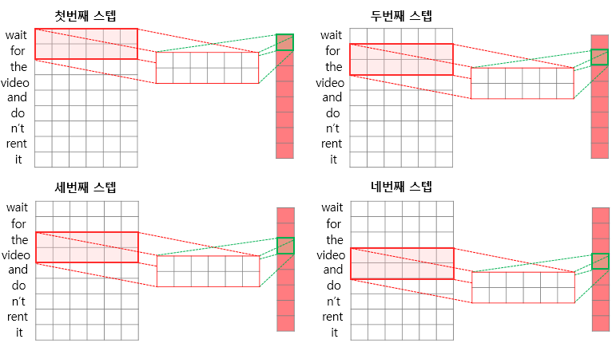
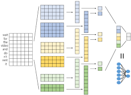

# 합성곱 신경망 모델 실습
* 텍스트 데이터의 임베딩 값은 입력 순서를 제외하면 입력값의 위치가 의미를 가지지 않는다. 따라서 2차원 합성곱을 사용하면 제대로 학습을 할 수 없다.

* 따라서 자연어 처리 모델에서는 2차원 합성곱이 아닌 1차원 합성곱을 사용하며, 2차원 합성곱은 수직, 수평 방향으로 합성곱 연산을 수행하는데 1차원 합성곱은 수직 방향으로만 합성곱 연산을 수행한다.

    <p align="center"></p>

* 1차원 합성곱을 수행하면 1차원 벡터를 출력값으로 얻게 되므로 풀링을 적용하면 하나의 스칼라값이 도출된다. 그러므로 크기가 다른 여러 개의 합성곱 필터를 사용하면 여러 개의 스칼라값을 얻을 수 있고 이러한 다양한 크기의 스칼라값을 모아 하나의 벡터로 연결하여 하나의 특징 벡터로 만들 수 있다.

    <p align="center"></p>

* 합성곱 계층 클래스
```
conv = torch.nn.Conv2d(
    in_channels,
    out_channels,
    kernel_size,
    stride=1,
    padding=0,
    dilation=1,
    groups=1,   # 입력 채널과 출력 채널을 하나의 그룹으로 묶는 것을 의미한다. 그룹을 2 이상의 값으로
                # 설정하면 입력 채널과 출력 채널을 더 작은 그룹으로 나눠 각각 합성곱 연산을 수행한다.
    bias=True,  # 계층에 편향 값 포함 여부를 설정
    padding_mode="zeros"
)
```

* 합성곱 기반 문장 분류 모델 정의
```
import torch
from torch import nn

class SentenceClassifier(nn.Module):
    def __init__(self, pretrained_embedding, filter_size, max_length, dropout=0.5):
        super().__init__()

        self.embedding = nn.Embedding.from_pretrained(
            torch.tensor(pretrained_embedding, dtype=torch.float32)
        )
        embedding_dim = self.embedding.weight.shape[1]

        conv = []
        for size in filter_size:
            conv.append(
                nn.Sequential(
                    nn.Conv1d(
                        in_channels=embedding_dim,
                        out_channels=1,
                        kernel_size=size
                    ),
                    nn.ReLU(),
                    nn.MaxPool1d(kernel_size=max_length-size-1),
                )
            )
        self.conv_filters = nn.ModuleList(conv)

        output_size = len(filter_size)
        self.pre_classifier = nn.Linear(output_size, output_size)
        self.dropout = nn.Dropout(dropout)
        self.classifier = nn.Linear(output_size, 1)

    def forward(self, inputs):
        embeddings = self.embedding(inputs)
        embeddings = embeddings.permute(0, 2, 1)

        conv_outputs = [conv(embeddings) for conv in self.conv_filters]
        concat_outputs = torch.cat([conv.squeeze(-1) for conv in conv_outputs], dim=1)

        logits = self.pre_classifier(concat_outputs)
        logits = self.dropout(logits)
        logits = self.classifier(logits)
        return logits
```